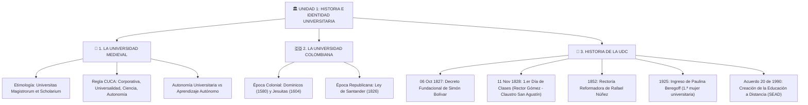

# 📚 Apuntes y Guía Maestro de Estudio — Unidad 1: Cátedra Institucional

**Asignatura:** Cátedra Institucional (FN24014)  
**Programa:** Ingeniería de Software (Modalidad a Distancia) — Universidad de Cartagena  
**Unidad 1:** Origen de la Universidad, la Universidad Colombiana e Historia de la UDC  
**Última actualización:** 08 de Agosto de 2026  

---

> [!NOTE]
> **Propósito de esta guía:** Consolidado integral de estudio de la Unidad 1 estructurado para repaso rápido, exámenes parciales y preparación de tutorías presenciales. Contiene conceptos, mnemotecnias, líneas de tiempo y banco de preguntas clave.

---

## 🗺️ Mapa de Estructura de la Unidad 1



---

## 🏛️ BLOQUE 1: Origen e Identidad de la Universidad Medieval

### 1.1 Etimología y Origen
- **Definición de *Universitas*:** Proviene del latín *universus-a-um* ("todo", "entero", "universal"), derivado de *unus* ("uno").
- **En la Edad Media (Siglo XII):** Se usaba en el latín medieval para designar a cualquier **gremio, corporación o asociación de personas** consideradas en su aspecto colectivo.
- **Expresión completa:** ***Universitas Magistrorum et Scholarium*** (Gremio/Asociación de Maestros y Estudiantes).
- **El Problema Original:** Los estudiantes y profesores se agrupaban para defender sus derechos e intereses económicos, jurídicos e intelectuales frente al poder de reyes, obispos y señores feudales.

> [!IMPORTANT]
> **Aclaración Clave:** La universidad en sus orígenes NO era un edificio ni un campus físico. Era un **gremio o sindicato del conocimiento**.

---

### 1.2 Las 4 Notas Fundamentales de la Universidad (Mnemotecnia: **CUCA**)

Para recordar las cuatro características esenciales de la institución universitaria, utilizá la sigla **CUCA**:

| Letra | Nota Fundamental | Descripción y Alcance |
| :---: | :--- | :--- |
| 🏰 **C** | **Corporativa** | La universidad tiene estructura de gremio, con estatutos propios, personería jurídica, jerarquía y reglamentos internos de funcionamiento. |
| 🌐 **U** | **Universalidad** | Posee tres dimensiones:<br>1. **Geográfica/Personal:** Abierta a estudiantes y profesores de cualquier país.<br>2. **Lingüística:** El **latín** como idioma único universal de la ciencia.<br>3. **Científica:** Unifica todas las ramas del saber (filosofía, medicina, derecho, teología) bajo una sola visión articulada. |
| 🔬 **C** | **Ciencia** | El conocimiento se construye mediante el rigor, el método analítico y el debate racional, superando dogmas y supersticiones. |
| 🛡️ **A** | **Autonomía** | Independencia política, jurídica y académica frente al poder de reyes, alcaldes o autoridades religiosas. |

---

### 1.3 Diferencia Crítica: Autonomía Universitaria vs. Aprendizaje Autónomo

```
┌────────────────────────────────────────────────────────────────────────────────────────┐
│                                 DIFERENCIA FUNDAMENTAL                                 │
├───────────────────────────────────────────┬────────────────────────────────────────────┤
│ 🛡️ AUTONOMÍA UNIVERSITARIA (INSTITUCIÓN)  │ 🧠 APRENDIZAJE AUTÓNOMO (ESTUDIANTE)       │
├───────────────────────────────────────────┼────────────────────────────────────────────┤
│ • Derecho POLÍTICO, JURÍDICO y ACADÉMICO  │ • Capacidad COGNITIVA y DE GESTIÓN         │
│ • La Universidad se autogobierna          │ • El estudiante gestiona su tiempo         │
│ • Elige autoridades y fija currículo      │ • Estudia de forma independiente           │
│ • Inmunidad frente a reyes y obispos      │ • Metodología propia de Ed. a Distancia    │
└───────────────────────────────────────────┴────────────────────────────────────────────┘
```

---

## 🇨🇴 BLOQUE 2: Nacimiento de la Universidad Colombiana

### 2.1 La Etapa Colonial (Siglos XVI - XVIII)
- Dominada por órdenes religiosas para la enseñanza de teología, gramática y latín a las élites.
- **1580:** Colegio de Santo Tomás (Dominicos) — Más tarde Universidad Tomista de Santafé.
- **1604:** Colegio Máximo de la Compañía de Jesús (Jesuitas) — Hoy Universidad Javeriana.
- **1653:** Colegio Mayor de Nuestra Señora del Rosario.
- **1801:** Colegio de Antioquia (hoy Universidad de Antioquia).

### 2.2 La Era Republicana y la Visión de los Próceres
- **Ley de 1826 (General Francisco de Paula Santander):** Primera ley republicana de educación. Santander ordenó crear universidades centrales (Bogotá, Quito y Caracas) y universidades seccionales en las capitales de departamento.
- **Objetivo Político:** Formar a los ciudadanos, líderes y profesionales capaces de dirigir y consolidar la nueva República independizada de España.
- **Ley 68 de 1935:** Reforma universitaria del siglo XX que reorganiza las facultades modernas.

---

## 🔰 BLOQUE 3: Historia e Identidad de la Universidad de Cartagena (UDC)

### 3.1 Fundación y Primeros Años (1827 - 1828)
- **6 de Octubre de 1827 (Decreto Fundacional):** El Libertador **Simón Bolívar** expide el decreto de creación de la **Universidad del Magdalena e Istmo** con sede en Cartagena de Indias.
  - *¿Por qué ese nombre?* Porque el departamento del Magdalena abarcaba todo el Caribe colombiano y el Istmo hacía referencia a Panamá.
- **11 de Noviembre de 1828 (Inicio de Clases):** Se inaugura oficialmente en el **Claustro de San Agustín** bajo la rectoría del canónigo **José Joaquín Gómez**.
- **Primeras Escuelas:** Filosofía y Letras, Medicina, y Jurisprudencia (Derecho).

### 3.2 Hitos Transformadores de la UDC

1. **La Rectoría de Rafael Núñez (1852):**
   - En 1850, una ley eliminó la exigencia de títulos académicos para ejercer profesiones.
   - Núñez asume la rectoría en 1852, salva a la universidad de la quiebra fiscal y académica, defiende la necesidad de títulos profesionales y propone la creación del Ministerio de Educación Pública.
2. **Desamortización de Manos Muertas (1861):**
   - Medida de Tomás Cipriano de Mosquera que traspasa definitivamente el Claustro de San Agustín a manos del Estado y de la Universidad.
3. **Pioneras en la Inclusión Femenina (1925):**
   - La UDC hace historia al matricular a **Paulina Beregoff** (estudiante de origen ruso), convirtiéndose en la primera mujer en ingresar a la universidad pública en Colombia.
4. **Creación de la Educación a Distancia (1990):**
   - Mediante el **Acuerdo N.º 20 de 1990** del Consejo Superior, nace el **Sistema de Educación Abierta y a Distancia (SEAD / CIDEAD)** con apoyo del BID, democratizando el acceso a la educación superior en la región.

---

## ⚡ Fichas de Repaso Rápido (Línea de Tiempo)

> [!TIP]
> **Memorizá esta secuencia lógica:** 1826 (Santander) ➔ 1827 (Bolívar) ➔ 1828 (Primer día de clases).

| Año / Norma | Hito Histórico Crucial | Protagonistas / Detalles |
| :---: | :--- | :--- |
| **1826** | Ley Republicana de Educación Superior | **Francisco de Paula Santander** (Crea universidades públicas). |
| **06 Oct 1827** | Decreto Fundacional UDC | **Simón Bolívar** (Crea la *Univ. del Magdalena e Istmo*). |
| **11 Nov 1828** | Inauguración e inicio de clases | **José Joaquín Gómez** (1.er Rector en Claustro San Agustín). |
| **1852** | Rectoría reformadora y rescate de la UDC | **Rafael Núñez** (Defensa de títulos e instituciones públicas). |
| **1925** | Hito de inclusión femenina en Colombia | **Paulina Beregoff** (1.ª mujer universitaria en Colombia). |
| **Acuerdo 20 (1990)** | Nacimiento del modelo a distancia UDC | **Consejo Superior UDC** (Creación del SEAD/CIDEAD). |

---

## ❓ Banco de Preguntas Frecuentes de Examen

> [!WARNING]
> **Pregunta Típica de Examen #1:** ¿Cuál es el significado etimológico original de *Universitas*?  
> **Respuesta:** Proviene del latín *universus* ("todo", "entero"). En el siglo XII designaba a la asociación o gremio de personas (*Universitas Magistrorum et Scholarium* / Gremio de maestros y alumnos).

> [!WARNING]
> **Pregunta Típica de Examen #2:** ¿Cuáles son las 4 notas de la universidad medieval?  
> **Respuesta:** Mnemotecnia **CUCA**: **C**orporativa, **U**niversalidad (geográfica, lingüística y científica), **C**iencia y **A**utonomía.

> [!WARNING]
> **Pregunta Típica de Examen #3:** ¿Por qué la UDC se llamó originalmente Universidad del Magdalena e Istmo?  
> **Respuesta:** Porque fue creada por Bolívar en 1827 para cubrir todo el Caribe colombiano (Departamento del Magdalena) y el territorio de Panamá (Istmo).

> [!WARNING]
> **Pregunta Típica de Examen #4:** ¿Quién fue el primer rector de la UDC y en qué sede inició?  
> **Respuesta:** El canónigo José Joaquín Gómez, iniciando clases el 11 de Noviembre de 1828 en el Claustro de San Agustín.

> [!WARNING]
> **Pregunta Típica de Examen #5:** ¿Qué norma creó la modalidad a distancia en la UDC?  
> **Respuesta:** El **Acuerdo N.º 20 de 1990** del Consejo Superior de la Universidad de Cartagena.
