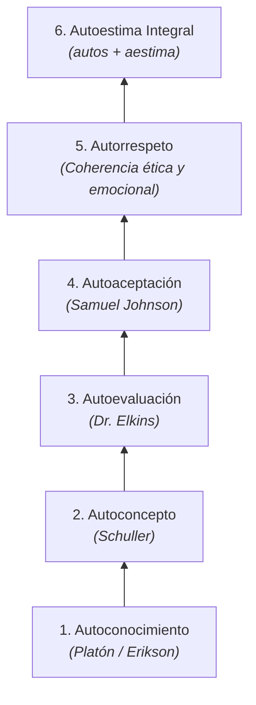

# 📚 Apuntes y Guía de Estudio — Unidad 2: Cátedra Institucional

**Asignatura:** Cátedra Institucional (FN24014)  
**Programa:** Ingeniería de Software — Universidad de Cartagena (CTEV)  
**Unidad 2:** Crecimiento Personal y Autoestima  
**Fecha:** Agosto 2026  

---

## 🗺️ Estructura Conceptual: La Escalera de la Autoestima

---

## 🪜 Los 6 Peldaños de la Escalera de la Autoestima

### 1. Autoconocimiento (*"Conócete a ti mismo" — Platón*)
- **Definición:** Identificar las partes que componen el yo: capacidades, talentos, limitaciones, necesidades y respuestas emocionales frente a distintas situaciones.
- **Enfoque de Erikson:** El individuo no funciona aislado; la identidad se construye en la interacción continua entre la persona y su entorno cultural.

### 2. Autoconcepto (*"Dale a un hombre una autoimagen pobre y acabará siendo un siervo" — Schuller*)
- **Definición:** El conjunto de creencias e ideas que una persona tiene sobre su propia identidad e inteligencia.
- **Impacto conductual:** Si alguien se percibe incapaz, actuará con torpeza; si se percibe competente y apto, actuará con seguridad.

### 3. Autoevaluación (*"El darse cuenta de uno mismo es la llave para cambiar y crecer" — Dr. Elkins*)
- **Definición:** Capacidad de juzgar objetivamente los propios actos frente a la realidad cotidiana, discriminando lo que enriquece de lo que resulta perjudicial.

### 4. Autoaceptación (*"La confianza en sí mismo es requisito para las grandes conquistas" — Samuel Johnson*)
- **Definición:** Reconocer las propias virtudes y fallas sin caer en el conformismo pasivo.
- **Principio clave:** Aceptar lo que no se puede cambiar y comprometerse a transformar lo que sí es modificable.

### 5. Autorrespeto
- **Definición:** Actuar de forma consecuente con los propios valores y límites personales. Manejar las emociones sin recurrir al autocastigo ni vulnerar la integridad de los demás.

### 6. Autoestima
- **Etimología:** Del griego *autos* (por sí mismo) y del latín *aestíma* (evaluar, tasar, valorar).
- **Definición:** Valoración global que la persona hace de su propio ser a partir de su autoimagen y sus vivencias.

---

## ⚖️ Cuadro Comparativo de Conductas

| Criterio | Autoestima Baja | Autoestima Adecuada |
| :--- | :--- | :--- |
| **Percepción personal** | Se siente inferior o falsamente superior a los demás. | No se considera mejor ni peor; reconoce su valor real. |
| **Manejo del error** | Se culpa por el pasado o culpa a terceros de sus fallas. | Asume responsabilidades y aprende de las equivocaciones. |
| **Tolerancia a la frustración** | Se pone a la defensiva, teme al fracaso y evita la ansiedad. | Acepta nuevos retos con entusiasmo y perseverancia. |
| **Manejo del tiempo y metas** | Se siente ineficiente, disperso y dependiente. | Organiza su tiempo, actúa con autonomía y busca objetivos. |
| **Relaciones interpersonales** | Conflictivas, agresivas o de excesiva complacencia. | Respeta las diferencias, sabe decir no y comunica con asertividad. |

---

## 📖 Bibliografía Oficial de la Unidad 2
- Cabrera Rivera, A. I. & Palacios López, A. D. (2019). *Desarrollo personal: soñando, planeando, haciendo*. Grupo Editorial Éxodo.
- Jiménez Cadena, Á. (2015). *Quiero y puedo acrecentar mi autoestima*. Editorial Paulinas.
- Panesso Giraldo, K. & Arango Holguín, M. J. (2017). *La autoestima, proceso humano*. Revista Electrónica Psyconex, 9(14), 1–9.
