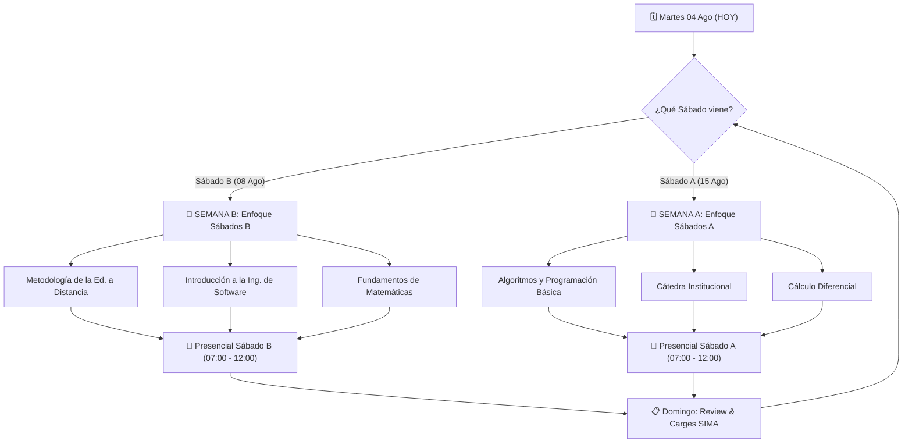

# 🗺️ Roadmap de Estudio y Horario Semestral UDC (2026-2)

[[Horario General|Horario General]] · [[Guía de Estudio|Guía de Estudio]] · [[UDC]]

---

> [!NOTE]
> **Planificación de Alto Rendimiento — Universidad de Cartagena**  
> **Inicio:** Martes, 04 de Agosto de 2026  
> **Metodología:** Gestión Quincenal Adaptativa basada en el bloque de tutorías del sábado siguiente (**Sábados A** vs **Sábados B**).

---

## 🔄 Flujo Metodológico Quincenal

---

## ⏱️ Rutina Semanal Adaptativa

### 📘 Rutina tipo "Semana B" (Preparando Sábado B)
*Aplica para las semanas del **04 al 08 Ago**, **18 al 22 Ago**, **01 al 05 Sep**, etc.*

| Día | Horario | Asignatura Objetiva | Actividad Específica a Realizar |
| :--- | :---: | :--- | :--- |
| **Martes** | 18:15 – 21:15 | **Inglés I (`ENGV001-E2`)** | 🏫 **Clase Oficial Presencial / Sincrónica** |
| **Miércoles** | 18:00 – 19:40 | [[Metodología de la Educación a Distancia/Metodología de la Educación a Distancia\|Metodología Ed. Distancia]] | Lecturas del módulo semanal (Moodle / roles docentes) y borrador de protocolo individual. |
| | 19:40 – 21:15 | [[Cátedra Institucional/Unidad 1/Actividad 1 - Reflexión de Vida\|Cátedra Institucional]] | Advance de **Actividad 1 — Reflexión de Vida** (7-12, 12-16, 17+ años). |
| **Jueves** | 18:00 – 19:40 | [[Introducción a la Ingeniería de Software/Introducción a la Ingeniería de Software\|Introducción a la Ing. Software]] | Lectura de capitulado (Pressman / Weber) y síntesis de infraestructura/SO. |
| | 19:40 – 21:15 | [[Fundamentos de Matemáticas/Fundamentos de Matemáticas\|Fundamentos de Matemáticas]] | Ejercicios prácticos de Lógica Proposicional, Tablas de Verdad o Conjuntos. |
| **Viernes** | 18:00 – 19:30 | [[Metodología de la Educación a Distancia/Metodología de la Educación a Distancia\|Metodología]] & [[Introducción a la Ingeniería de Software/Introducción a la Ingeniería de Software\|Ing. Software]] | Finalización de Protocolos Individuales y participación en Foros en SIMA. |
| | 19:30 – 21:00 | **CIPAS / TCC** | Coordinación grupal y avance en la redacción del TCC (3.000 palabras). |
| **Sábado** | **07:00 – 12:00** | **Tutorías Presenciales Sábados B** | 🏫 **07:00** Metodología \| **08:40** Ing. Software \| **10:20** Fundamentos |
| **Domingo** | 16:00 – 18:00 | **Weekly Review & SIMA** | Carga de archivos PDF en SIMA y preparación de la siguiente semana. |

---

### 📗 Rutina tipo "Semana A" (Preparando Sábado A)
*Aplica para las semanas del **09 al 15 Ago**, **23 al 29 Ago**, **06 al 12 Sep**, etc.*

| Día | Horario | Asignatura Objetiva | Actividad Específica a Realizar |
| :--- | :---: | :--- | :--- |
| **Martes** | 18:15 – 21:15 | **Inglés I (`ENGV001-E2`)** | 🏫 **Clase Oficial Presencial / Sincrónica** |
| **Miércoles** | 18:00 – 19:40 | [[Algoritmos y Programación Básica/Algoritmos y Programación Básica\|Algoritmos y Programación]] | Práctica en computadora (pseudocódigo, compilación en Java JDK, ciclos/arreglos). |
| | 19:40 – 21:15 | [[Cátedra Institucional/Cátedra Institucional\|Cátedra Institucional]] | Lecturas de Proyecto de Vida, Autoestima o Historia UDC + preparación de protocolos. |
| **Jueves** | 18:00 – 20:30 | [[Cálculo Diferencial/Cálculo Diferencial\|Cálculo Diferencial]] | Resolución a mano de problemas de límites, continuidad o derivadas. |
| **Viernes** | 18:00 – 19:30 | [[Algoritmos y Programación Básica/Algoritmos y Programación Básica\|Algoritmos]] & [[Cálculo Diferencial/Cálculo Diferencial\|Cálculo]] | Consolidación de respuestas para las tutorías del sábado y foros SIMA. |
| | 19:30 – 21:00 | **CIPAS / TCC** | Reunión CIPAS para aplicar conceptos de Cálculo o Algoritmos al TCC. |
| **Sábado** | **07:00 – 12:00** | **Tutorías Presenciales Sábados A** | 🏫 **07:00** Algoritmos \| **08:40** Cátedra \| **10:20** Cálculo |
| **Domingo** | 16:00 – 18:00 | **Weekly Review & SIMA** | Carga de protocolos definitivos en SIMA. |

---

## 🎯 Roadmap Ejecutable Semanal (Semestre 2026-2)

> [!TIP]
> Marcá con un `[x]` las actividades a medida que las vayas completando en el semestre.

### 🔴 Agosto 2026

#### 📍 Semana 1: Del 04 al 08 de Agosto (Preparación SÁBADO B)
- [ ] **Martes 04:** Apertura oficial del semestre y asistencia a clase de **Inglés I** (18:15 hs).
- [ ] **Miércoles 05:** [[Metodología de la Educación a Distancia/Cronograma de Actividades|Metodología (Semana 1-2)]] — Lectura de roles docentes y Moodle (Hernández-Sellés).
- [ ] **Miércoles 05:** [[Cátedra Institucional/Unidad 1/Actividad 1 - Reflexión de Vida|Cátedra]] — Iniciar borrador de la Actividad 1 (Reflexión 7-12, 12-16, 17+ años).
- [ ] **Jueves 06:** [[Introducción a la Ingeniería de Software/Cronograma de Actividades|Ing. Software (Semana 1)]] — Lectura de principios e infraestructura (Pressman).
- [ ] **Jueves 06:** [[Fundamentos de Matemáticas/Cronograma de Actividades|Fundamentos (Semana 1)]] — Lectura de lógica proposicional y conectivos (Miller).
- [ ] **Viernes 07:** Redacción final del protocolo individual para el Sábado B.
- [ ] **Sábado 08 (Presencial B):** 🏫 Tutorías de **Metodología** (07:00), **Ing. Software** (08:40) y **Fundamentos** (10:20).
- [ ] **Domingo 09:** Carga de primeras evidencias en SIMA.

#### 📍 Semana 2: Del 09 al 15 de Agosto (Preparación SÁBADO A)
- [ ] **Martes 11:** Clase de **Inglés I** (18:15 hs).
- [ ] **Miércoles 12:** [[Algoritmos y Programación Básica/Cronograma de Actividades|Algoritmos (Semana 1-2)]] — Configuración de entorno Java JDK y compilación.
- [ ] **Miércoles 12:** [[Cátedra Institucional/Unidad 1/Actividad 1 - Reflexión de Vida|Cátedra]] — Finalizar y convertir a PDF la **Actividad 1 — Reflexión de Vida**.
- [ ] **Jueves 13:** [[Cálculo Diferencial/Cronograma de Actividades|Cálculo (Semana 1-2)]] — Resolución de ejercicios de límites e indeterminaciones.
- [ ] **Viernes 14:** Carga en SIMA de la **Actividad 1 de Cátedra** (Plazo límite: Lun 17 Ago).
- [ ] **Sábado 15 (Presencial A):** 🏫 Tutorías de **Algoritmos** (07:00), **Cátedra** (08:40) y **Cálculo** (10:20).

#### 📍 Semana 3: Del 16 al 22 de Agosto (Preparación SÁBADO B)
- [ ] **Martes 18:** Clase de **Inglés I**.
- [ ] **Miércoles 19:** [[Metodología de la Educación a Distancia/Cronograma de Actividades|Metodología (Semana 3)]] — **Entregable:** Línea de tiempo sobre historia de Ed. a Distancia.
- [ ] **Jueves 20:** [[Introducción a la Ingeniería de Software/Cronograma de Actividades|Ing. Software (Semana 3)]] — Síntesis de procesadores y memoria (Weber).
- [ ] **Jueves 20:** [[Fundamentos de Matemáticas/Cronograma de Actividades|Fundamentos (Semana 3)]] — Ejercicios de Notación y Clases de Conjuntos.
- [ ] **Sábado 22 (Presencial B):** 🏫 Tutorías de **Metodología**, **Ing. Software** y **Fundamentos**.

#### 📍 Semana 4: Del 23 al 29 de Agosto (Cierre 1.er Corte)
- [ ] **Miércoles 26:** [[Algoritmos y Programación Básica/Cronograma de Actividades|Algoritmos (Semana 4)]] — Ejercicio "¡Hola Mundo!" compilado en Java.
- [ ] **Jueves 27:** [[Cálculo Diferencial/Cronograma de Actividades|Cálculo (Semana 4)]] — Límites laterales y al infinito.
- [ ] **Viernes 28:** 🚨 **Cierre del 1.er Corte en SIMA.** Verificación de notas cargadas.
- [ ] **Sábado 29 (Presencial A):** 🏫 Tutorías de **Algoritmos**, **Cátedra** y **Cálculo**.

---

### 🟡 Septiembre 2026

#### 📍 Semana 5: Del 30 Ago al 05 de Septiembre (Preparación SÁBADO B)
- [ ] **Miércoles 02:** [[Introducción a la Ingeniería de Software/Cronograma de Actividades|Ing. Software (Semana 5)]] — **Entregable:** Línea de tiempo de Arquitectura de Computadoras (RISC vs CISC).
- [ ] **Jueves 03:** [[Fundamentos de Matemáticas/Cronograma de Actividades|Fundamentos (Semana 5)]] — Ejercicios de Expresiones Algebraicas y Polinomios.
- [ ] **Sábado 05 (Presencial B):** 🏫 Tutorías de **Metodología**, **Ing. Software** y **Fundamentos**.

#### 📍 Semana 6: Del 06 al 12 de Septiembre (Preparación SÁBADO A)
- [ ] **Miércoles 09:** [[Introducción a la Ingeniería de Software/Cronograma de Actividades|Ing. Software (Semana 6)]] — **Entregable:** Infografía / Mapa conceptual sobre el Funcionamiento de Internet.
- [ ] **Jueves 10:** [[Cálculo Diferencial/Cronograma de Actividades|Cálculo (Semana 6)]] — **Taller Unidad 2:** Continuidad en un intervalo.
- [ ] **Sábado 12 (Presencial A):** 🏫 Tutorías de **Algoritmos**, **Cátedra** y **Cálculo**.

#### 📍 Semana 7 & 8: Del 13 al 26 de Septiembre
- [ ] **CIPAS:** Elección de empresa/comunidad real para el [[Cálculo Diferencial/Trabajo Colaborativo 5/Rúbrica TCC|TCC de 3.000 palabras]] en todas las materias.
- [ ] **Sábado 19 (Presencial B):** 🏫 Tutorías presenciales.
- [ ] **Sábado 26 (Presencial A):** 🏫 Tutorías presenciales.
- [ ] **Lunes 28:** 🚨 **Cierre del 2.º Corte en SIMA.**

---

### 🔵 Octubre 2026

#### 📍 Semana 9 & 10: Del 27 Sep al 10 de Octubre
- [ ] **Ing. Software (Semana 9):** **Entregable:** Cuadro comparativo de Sistemas Operativos (Windows, Linux, Mac, iOS, Android).
- [ ] **Fundamentos (Semana 10):** **Entregable:** Ensayo sobre problemas resueltos con Ecuaciones Cuadráticas.
- [ ] **Metodología (Semana 10):** **Entregable:** Mapa conceptual de Los 3 Momentos del Aprendizaje.
- [ ] **Sábado 03 (Presencial B):** 🏫 Tutorías presenciales.
- [ ] **Sábado 10 (Presencial A):** 🏫 Tutorías presenciales.

#### 📍 Semana 11 & 12: Del 11 al 24 de Octubre
- [ ] **Ing. Software (Semana 11):** **Entregable:** Análisis de casos de uso de Internet de las Cosas (IoT).
- [ ] **Cátedra (Semana 13):** **Entregable:** Ensayo reflexivo sobre La Motivación (Unidad 4).
- [ ] **CIPAS:** Consolidación del TCC borrador de 3.000 palabras (versión 1.0).
- [ ] **Sábado 17 (Presencial B):** 🏫 Tutorías presenciales.
- [ ] **Sábado 24 (Presencial A):** 🏫 Tutorías presenciales.

---

### 🟢 Noviembre / Diciembre 2026 (Cierre de Semestre)

#### 📍 Semana 13 a 16: Del 25 Oct al 21 de Noviembre
- [ ] **Metodología (Semana 13):** **Entregable:** Infografía de Fundamentos Pedagógicos de Ed. a Distancia.
- [ ] **Ing. Software (Semana 13):** **Entregable:** Análisis práctico de Metadatos y cabeceras de archivos.
- [ ] **Cálculo (Semana 14):** **Taller Unidad 4:** Criterios de la Segunda Derivada.
- [ ] **Metodología (Semana 16):** **Entregable:** Actividad práctica de Evaluación del Aprendizaje en Línea.
- [ ] **CIPAS:** Carga definitiva de los documentos TCC en SIMA para todas las materias.
- [ ] **Sábado 31 Oct (Presencial B):** 🏫 Última tutoría presencial Sábados B.
- [ ] **Sábado 07 Nov (Presencial A):** 🏫 Última tutoría presencial Sábados A.
- [ ] **Sábado 21 Nov (Presencial B):** 🏫 Cierre presencial.

#### 📍 Parciales Finales y Evaluaciones
- [ ] **Sábado 28 Noviembre:** 📝 **Parciales Presenciales Sábados A** (Algoritmos, Cátedra, Cálculo).
- [ ] **Sábado 05 Diciembre:** 📝 **Parciales Presenciales Sábados B** (Metodología, Ing. Software, Fundamentos).
- [ ] **Sábado 12 Diciembre:** 🔄 **Supletorios.**
- [ ] **Sábado 19 Diciembre:** 🏁 **Habilitaciones y Cierre Definitivo.**
