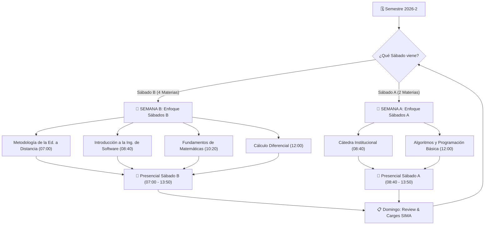

# 🗺️ Roadmap de Estudio y Horario Semestral UDC (2026-2)

[[Horario General|Horario General]] · [[Guía de Estudio|Guía de Estudio]] · [[UDC]]

---

> [!NOTE]
> **Planificación de Alto Rendimiento — Universidad de Cartagena**  
> **Inicio:** Martes, 04 de Agosto de 2026  
> **Metodología:** Gestión Quincenal Adaptativa basada en el bloque de tutorías del sábado siguiente (**Sábados A** vs **Sábados B**).

---

## 📋 Tablero Master de Actividades y Entregas (Todas las Materias)

> [!IMPORTANT]
> **Consolidado General de Entregas y Tareas — Semestre 2026-2 (6 Materias)**  
> *Fecha actual de referencia: Lunes, 17 de Agosto de 2026*  
> *Nota sobre Cuestionarios:* Las evaluaciones/cuestionarios en SIMA se habilitan el mismo día fijado en la plataforma y se presentan ese mismo día.

| Estado | Día / Fecha Límite | Asignatura | Actividad / Entregable Específico | Destino / Plataforma |
| :---: | :--- | :--- | :--- | :--- |
| 🟢 **Subido** | **Completado** | **Metodología** | Protocolo Individual 1 cargado oficialmente en plataforma SIMA | Entregado en SIMA |
| 🟢 **Subido** | **Completado** | **Cátedra** | Actividad 1 (Reflexión de Vida) cargada oficialmente en SIMA | Entregado en SIMA |
| 🟢 **Subido** | **Completado** | **Cátedra** | Protocolo Individual Unidad 1 cargado oficialmente en SIMA | Entregado en SIMA |
| 🟢 **Subido** | **Completado** | **Cátedra** | Protocolo Colaborativo Unidad 1 cargado oficialmente en SIMA | Entregado en SIMA |
| 🟢 **Subido** | **Completado** | **Cálculo** | Protocolo Individual Unidad 1 cargado oficialmente en SIMA | Entregado en SIMA |
| 🟢 **Subido** | **Completado** | **Metodología** | Línea de tiempo sobre Historia de la Educación a Distancia cargada oficialmente en SIMA | Entregado en SIMA |
| 🟢 **Subido** | **Completado** | **Cátedra** | 📝 Evaluación Cuestionario Unidad 1 presentado y aprobado en SIMA | Entregado en SIMA |
| 🏫 **Pasado** | **Sábado 15 Ago** | **Presencial A** | 🏫 **Tutorías Sábados A**: Cátedra (08:40), Algoritmos (12:00) | Piedra de Bolívar |
| 🟢 **Subido** | **Completado** | **Fundamentos** | Protocolo Individual Unidad 1 cargado oficialmente en SIMA | Entregado en SIMA |
| 🟢 **Subido** | **Completado** | **Fundamentos** | Protocolo Colaborativo Unidad 1 cargado oficialmente en SIMA | Entregado en SIMA |
| 🏫 **Esta Semana** | **Sábado 22 Ago** | **Presencial B** | 🏫 **Tutorías Sábados B**: Metodología (07:00), Ing. Software (08:40), Fundamentos (10:20), Cálculo (12:00) | Piedra de Bolívar |
| ⏳ **Próximo** | **Miércoles 26 Ago** | **Cátedra** | 📝 **Protocolo Individual Unidad 2** | Campus SIMA (23:41 hs) |
| ⏳ **Próximo** | **Miércoles 26 Ago** | **Fundamentos** | 📝 **Actividad de la Unidad 1** | Campus SIMA (23:59 hs) |
| ⏳ **Próximo** | **Jueves 27 Ago** | **Cátedra** | 📝 **Protocolo Colaborativo Unidad 2** | Campus SIMA (23:42 hs) |
| 📌 **Cierre Corte** | **Viernes 28 Ago** | **Todas (6)** | 🚨 **Cierre Oficial 1.er Corte Evaluativo (Acumulado 60% en SIMA)** | Campus SIMA |
| 🏫 **Próximo** | **Sábado 29 Ago** | **Presencial A** | 🏫 **Tutorías Sábados A**: Cátedra (08:40), Algoritmos (12:00) | Piedra de Bolívar |
| ⏳ **Próximo** | **Domingo 30 Ago** | **Fundamentos** | 📝 **Evaluación Cuestionario Unidad 1** | Campus SIMA (23:59 hs) |
| ⏳ **Próximo** | **Lunes 31 Ago** | **Cátedra** | 📝 **Evaluación Cuestionario Unidad 2** | Campus SIMA (23:21 hs) |
| ⏳ **Próximo** | **Lunes 31 Ago** | **Cátedra** | 📝 **Actividad de la Unidad 2** | Campus SIMA (23:43 hs) |
| 📅 **Programado** | **Miércoles 02 Sep** | **Ing. Software** | 📝 **Entregable:** Línea de tiempo de Arquitectura de Computadoras (RISC vs CISC) | Campus SIMA (23:57 hs) |
| 📅 **Programado** | **Miércoles 09 Sep** | **Ing. Software** | 📝 **Entregable:** Infografía / Mapa conceptual "Cómo funciona Internet" | Campus SIMA (23:57 hs) |
| 📅 **Programado** | **Jueves 10 Sep** | **Algoritmos** | 📝 **Protocolo Individual Unidad 1** | Campus SIMA (23:59 hs) |
| 📅 **Programado** | **Jueves 10 Sep** | **Algoritmos** | 📝 **Protocolo Colaborativo Unidad 1** | Campus SIMA (23:59 hs) |
| 📅 **Programado** | **Viernes 11 Sep** | **Cálculo** | 📝 **Taller Unidad 2:** Continuidad en un intervalo y Teorema de Valor Intermedio | Campus SIMA (23:57 hs) |
| 📅 **Programado** | **Martes 15 Sep** | **Algoritmos** | 📝 **Actividad de la Unidad 1** | Campus SIMA (23:59 hs) |
| 📅 **Programado** | **Viernes 18 Sep** | **Ing. Software** | 📝 **Actividad de la Unidad 1** | Campus SIMA (23:57 hs) |
| 📅 **Programado** | **Viernes 18 Sep** | **Ing. Software** | 📝 **Protocolo Colaborativo Unidad 1** | Campus SIMA (23:57 hs) |
| 📅 **Programado** | **Domingo 20 Sep** | **Algoritmos** | 📝 **Evaluación Cuestionario Unidad 1** | Campus SIMA (23:59 hs) |
| 📌 **Cierre Corte** | **Lunes 28 Sep** | **Todas (6)** | 🚨 **Cierre Oficial 2.º Corte Evaluativo en SIMA** | Campus SIMA |
| 📅 **Programado** | **Miércoles 30 Sep** | **Ing. Software** | 📝 **Entregable:** Cuadro comparativo de Sistemas Operativos (Windows/Linux/Mac) | Campus SIMA (23:57 hs) |
| 📅 **Programado** | **Miércoles 07 Oct** | **Metodología** | 📝 **Entregable:** Mapa conceptual de Los 3 Momentos del Aprendizaje | Campus SIMA (23:57 hs) |
| 📅 **Programado** | **Viernes 09 Oct** | **Fundamentos** | 📝 **Taller Unidad 3:** Resolución de problemas con Ecuaciones Cuadráticas | Campus SIMA (23:57 hs) |
| 📅 **Programado** | **Miércoles 14 Oct** | **Ing. Software** | 📝 **Entregable:** Análisis de casos de uso de Internet de las Cosas (IoT) | Campus SIMA (23:57 hs) |
| 📅 **Programado** | **Viernes 23 Oct** | **Algoritmos** | 📝 **Taller Unidad 3:** Funciones y Modularidad en Java | Campus SIMA (23:57 hs) |
| 📅 **Programado** | **Miércoles 28 Oct** | **Cátedra** | 📝 **Entregable:** Ensayo reflexivo sobre La Motivación (Unidad 4) | Campus SIMA (23:57 hs) |
| 📅 **Programado** | **Jueves 29 Oct** | **Metodología** | 📝 **Entregable:** Infografía de Fundamentos Pedagógicos de Ed. a Distancia | Campus SIMA (23:57 hs) |
| 📅 **Programado** | **Viernes 30 Oct** | **Ing. Software** | 📝 **Entregable:** Análisis práctico de Metadatos y cabeceras de archivos | Campus SIMA (23:57 hs) |
| 📅 **Programado** | **Miércoles 04 Nov** | **Cálculo** | 📝 **Taller Unidad 4:** Concavidad y Criterio de la Segunda Derivada | Campus SIMA (23:57 hs) |
| 📅 **Programado** | **Jueves 05 Nov** | **Fundamentos** | 📝 **Taller Unidad 4:** Identidades e inecuaciones trigonométricas | Campus SIMA (23:57 hs) |
| 📅 **Programado** | **Miércoles 18 Nov** | **Metodología** | 📝 **Entregable:** Actividad práctica de Evaluación del Aprendizaje en Línea | Campus SIMA (23:57 hs) |
| 📅 **Programado** | **Viernes 20 Nov** | **CIPAS (Todas 6)**| 📋 **Entrega Definitiva del TCC (3.000 palabras)** en plataforma SIMA | Campus SIMA (23:57 hs) |
| 🎓 **Examen Final** | **Sábado 28 Nov** | **Sábados A** | 📝 **Exámenes Finales Presenciales (40%)**: Cátedra y Algoritmos | Piedra de Bolívar |
| 🎓 **Examen Final** | **Sábado 05 Dic** | **Sábados B** | 📝 **Exámenes Finales Presenciales (40%)**: Metodología, Ing. Software, Fundamentos y Cálculo | Piedra de Bolívar |

---

## 🔄 Flujo Metodológico Quincenal

---

## ⏱️ Rutina Semanal Adaptativa

### 📘 Rutina tipo "Semana B" (Preparando Sábado B)
*Aplica para las semanas del **04 al 08 Ago**, **18 al 22 Ago**, **01 al 05 Sep**, etc.*

| Día | Horario | Asignatura Objetiva | Actividad Específica a Realizar |
| :--- | :---: | :--- | :--- |
| **Miércoles** | 13:50 – 17:10 | **Inglés I (`ENGV001-E2`)** | 💻 **Clase Sincrónica 100% Virtual** (1:50 p.m. – 5:10 p.m.) |
| | 18:00 – 19:40 | [[Metodología de la Educación a Distancia/Metodología de la Educación a Distancia\|Metodología Ed. Distancia]] | Lecturas del módulo semanal (Moodle / roles docentes) y borrador de protocolo individual. |
| | 19:40 – 21:15 | [[Fundamentos de Matemáticas/Fundamentos de Matemáticas\|Fundamentos de Matemáticas]] | Ejercicios prácticos de Lógica Proposicional, Tablas de Verdad o Conjuntos. |
| **Jueves** | 18:00 – 19:40 | [[Introducción a la Ingeniería de Software/Introducción a la Ingeniería de Software\|Introducción a la Ing. Software]] | Lectura de capitulado (Pressman / Weber) y síntesis de infraestructura/SO. |
| | 19:40 – 21:15 | [[Cálculo Diferencial/Cálculo Diferencial\|Cálculo Diferencial]] | Resolución a mano de problemas de límites, continuidad o derivadas. |
| **Viernes** | 18:00 – 19:30 | [[Metodología de la Educación a Distancia/Metodología de la Educación a Distancia\|Metodología]] & [[Introducción a la Ingeniería de Software/Introducción a la Ingeniería de Software\|Ing. Software]] | Finalización de Protocolos Individuales y participación en Foros en SIMA. |
| | 19:30 – 21:00 | **CIPAS / TCC** | Coordinación grupal y avance en la redacción del TCC (3.000 palabras). |
| **Sábado** | **07:00 – 13:50** | **Tutorías Presenciales Sábados B** | 🏫 **07:00** Metodología \| **08:40** Ing. Software \| **10:20** Fundamentos \| **12:00** Cálculo |
| **Domingo** | 16:00 – 18:00 | **Weekly Review & SIMA** | Carga de archivos PDF en SIMA y preparación de la siguiente semana. |

---

### 📗 Rutina tipo "Semana A" (Preparando Sábado A)
*Aplica para las semanas del **09 al 15 Ago**, **23 al 29 Ago**, **06 al 12 Sep**, etc.*

| Día | Horario | Asignatura Objetiva | Actividad Específica a Realizar |
| :--- | :---: | :--- | :--- |
| **Miércoles** | 13:50 – 17:10 | **Inglés I (`ENGV001-E2`)** | 💻 **Clase Sincrónica 100% Virtual** (1:50 p.m. – 5:10 p.m.) |
| | 18:00 – 19:40 | [[Algoritmos y Programación Básica/Algoritmos y Programación Básica\|Algoritmos y Programación]] | Práctica en computadora (pseudocódigo, compilación en Java JDK, ciclos/arreglos). |
| | 19:40 – 21:15 | [[Cátedra Institucional/Cátedra Institucional\|Cátedra Institucional]] | Lecturas de Proyecto de Vida, Autoestima o Historia UDC + preparación de protocolos. |
| **Jueves** | 18:00 – 20:30 | [[Algoritmos y Programación Básica/Algoritmos y Programación Básica\|Algoritmos y Programación]] | Desarrollo de lógica y ejercicios de programación en Java. |
| **Viernes** | 18:00 – 19:30 | [[Cátedra Institucional/Cátedra Institucional\|Cátedra]] & [[Algoritmos y Programación Básica/Algoritmos y Programación Básica\|Algoritmos]] | Consolidación de respuestas para las tutorías del sábado y foros SIMA. |
| | 19:30 – 21:00 | **CIPAS / TCC** | Reunión CIPAS para el avance del TCC. |
| **Sábado** | **08:40 – 13:50** | **Tutorías Presenciales Sábados A** | 🏫 **08:40** Cátedra (Bloque A 305) \| *(10:20 Libre)* \| **12:00** Algoritmos (Bloque G 204) |
| **Domingo** | 16:00 – 18:00 | **Weekly Review & SIMA** | Carga de protocolos definitivos en SIMA. |

---

## 🎯 Roadmap Ejecutable por Unidades y Semanas (Semestre 2026-2)

> [!TIP]
> **Estructura Oficial:** 4 Unidades temáticas a lo largo de 16 semanas.  
> Marcá con un `[x]` las actividades completadas.

---

### 🔴 UNIDAD 1: Fundamentos y Adaptación Universitaria (Semanas 1 a 4: Del 04 al 29 de Agosto)

#### 📍 Semana 1 (Intensiva): Del 04 al 08 de Agosto (SÁBADO B + Nivelación SÁBADO A)
- [x] **Metodología (U1):** Protocolo Individual 1 cargado oficialmente en plataforma SIMA.
- [x] **Cátedra (U1):** Actividad 1 (Reflexión de Vida) borrador completo listo con datos reales.
- [ ] **Ing. Software (U1):** Lectura Módulo 1 (Arquitectura de computadoras y hardware).
- [ ] **Fundamentos (U1):** Módulo 1: Lógica proposicional, conectivos y tablas de verdad.
- [ ] **Cálculo (U1):** Módulo 1: Concepto intuitivo de límites e indeterminaciones algebraicas.
- [ ] **Algoritmos (U1):** Módulo 1: Concepto de algoritmo, pseudocódigo y diagramas de flujo.
- [ ] **Sábado 08 (Presencial B):** 🏫 Tutorías de **Metodología** (07:00), **Ing. Software** (08:40) y **Fundamentos** (10:20).

#### 📍 Semana 2: Del 09 al 15 de Agosto (Preparación SÁBADO A)
- [x] **Cátedra (U1):** Actividad 1 (Reflexión de Vida) cargada oficialmente en plataforma SIMA.
- [x] **Cátedra (U1):** 📝 **Protocolo Individual U1** (Plazo SIMA: Miércoles 12 Ago, 23:55 hs).
- [x] **Cátedra (U1):** 📝 **Protocolo Colaborativo U1** (Plazo SIMA: Jueves 13 Ago, 23:55 hs).
- [x] **Cálculo (U1):** 📝 **Protocolo Individual U1** (Cargado oficialmente en SIMA).
- [x] **Cátedra (U1):** 📝 **Evaluación Cuestionario U1** (Presentada y completada en SIMA el Lunes 17 Ago).
- [ ] **Metodología (U1):** Los 3 momentos del aprendizaje (Estudio autónomo TAE, CIPAS, Tutoría).
- [ ] **Algoritmos (U1):** Configuración del entorno de desarrollo Java JDK e IDE.
- [ ] **Cálculo (U1):** Factorización y racionalización para resolución de límites.
- [ ] **Fundamentos (U1):** Tablas de verdad: Tautología, Contradicción y Contingencia.
- [ ] **Ing. Software (U1):** Periféricos de entrada/salida y buses de datos.
- [x] **Sábado 15 (Presencial A):** 🏫 Tutorías de **Algoritmos** (07:00), **Cátedra** (08:40) y **Cálculo** (10:20).

#### 📍 Semana 3: Del 16 al 22 de Agosto (Preparación SÁBADO B)
- [x] **Metodología (U1):** 📝 **Entregable:** Línea de tiempo sobre Historia de la Educación a Distancia (Cargada oficialmente en SIMA).
- [ ] **Ing. Software (U1):** Memoria RAM, ROM, memoria caché y almacenamiento.
- [ ] **Fundamentos (U1):** Notación y clases de conjuntos (Pertenencia e Inclusión).
- [ ] **Cálculo (U1):** Límites laterales, infinitos y al infinito.
- [ ] **Algoritmos (U1):** Estructuras secuenciales y tipos de datos primitivos en Java.
- [ ] **Cátedra (U1):** Proyecto de Vida inicial e historia de la Universidad de Cartagena.
- [ ] **Sábado 22 (Presencial B):** 🏫 Tutorías de **Metodología** (07:00), **Ing. Software** (08:40), **Fundamentos** (10:20) y **Cálculo** (12:00).

#### 📍 Semana 4: Del 23 al 29 de Agosto (Cierre 1.er Corte Evaluativo)
- [ ] **Fundamentos (U1):** 📝 **Protocolo Individual U1** (Plazo SIMA: Lunes 24 Ago, 23:59 hs).
- [ ] **Fundamentos (U1):** 📝 **Protocolo Colaborativo U1** (Plazo SIMA: Martes 25 Ago, 23:59 hs).
- [ ] **Fundamentos (U1):** 📝 **Actividad de la Unidad 1** (Plazo SIMA: Miércoles 26 Ago, 23:59 hs).
- [ ] **Fundamentos (U1):** 📝 **Evaluación Cuestionario U1** (Plazo SIMA: Domingo 30 Ago, 23:59 hs).
- [ ] **Algoritmos (U1):** Estructuras condicionales (`if-else` y `switch`) en Java.
- [ ] **Cálculo (U1):** Asíntotas verticales y horizontales de una función.
- [ ] **Metodología (U1):** Métodos asincrónicos y sincrónicos en plataformas virtuales.
- [ ] **Cátedra (U1):** Símbolos institucionales y Reglamento Estudiantil UDC.
- [ ] **Sábado 29 (Presencial A):** 🏫 Tutorías de **Cátedra** (08:40) y **Algoritmos** (12:00).
- [ ] **Viernes 28 Ago:** 🚨 **Cierre Oficial del 1.er Corte Evaluativo en SIMA (Acumulado 60%).**

---

### 🟡 UNIDAD 2: Modelos Pedagógicos y Herramientas Técnicas (Semanas 5 a 8: Del 30 Ago al 26 Sep)

#### 📍 Semana 5: Del 30 Ago al 05 de Septiembre (Preparación SÁBADO B)
- [ ] **Ing. Software (U2):** 📝 **Entregable:** Línea de tiempo de Arquitectura de Computadoras (RISC vs CISC).
- [ ] **Fundamentos (U2):** Expresiones algebraicas, polinomios y productos notables.
- [ ] **Metodología (U2):** Estrategias de "Aprender a aprender" en entornos a distancia.
- [ ] **Cátedra (U2):** Crecimiento personal, autoconocimiento y autoestima.
- [ ] **Cálculo (U2):** Concepto de continuidad de una función en un punto.
- [ ] **Algoritmos (U2):** Variables, operadores aritméticos y lógicos en Java.
- [ ] **Sábado 05 (Presencial B):** 🏫 Tutorías de **Metodología**, **Ing. Software**, **Fundamentos** y **Cálculo**.

#### 📍 Semana 6: Del 06 al 12 de Septiembre (Preparación SÁBADO A)
- [ ] **Ing. Software (U2):** 📝 **Entregable:** Infografía / Mapa conceptual "Cómo funciona Internet".
- [ ] **Algoritmos (U1):** 📝 **Protocolo Individual U1** (Plazo SIMA: Jueves 10 Sep, 23:59 hs).
- [ ] **Algoritmos (U1):** 📝 **Protocolo Colaborativo U1** (Plazo SIMA: Jueves 10 Sep, 23:59 hs).
- [ ] **Cálculo (U2):** 📝 **Taller Unidad 2:** Continuidad en un intervalo y Teorema del Valor Intermedio.
- [ ] **Fundamentos (U2):** Factorización de polinomios (Casos I al X).
- [ ] **Cátedra (U2):** Desarrollo personal y proyección de metas universitarias.
- [ ] **Metodología (U2):** Calidad de la enseñanza a distancia y modelos constructivistas.
- [ ] **Algoritmos (U2):** Estructuras condicionales compuestas y anidadas.
- [ ] **Sábado 12 (Presencial A):** 🏫 Tutorías de **Cátedra** (08:40) y **Algoritmos** (12:00).

#### 📍 Semana 7 & 8: Del 13 al 26 de Septiembre (Cierre 2.º Corte Evaluativo)
- [ ] **Metodología (U2):** Manejo avanzado y prácticas en el Campus Virtual SIMA.
- [ ] **Algoritmos (U1):** 📝 **Actividad de la Unidad 1** (Plazo SIMA: Martes 15 Sep, 23:59 hs).
- [ ] **Ing. Software (U1):** 📝 **Actividad de la Unidad 1** (Plazo SIMA: Viernes 18 Sep, 23:57 hs).
- [ ] **Ing. Software (U1):** 📝 **Protocolo Colaborativo U1** (Plazo SIMA: Viernes 18 Sep, 23:57 hs).
- [ ] **Algoritmos (U1):** 📝 **Evaluación Cuestionario U1** (Plazo SIMA: Domingo 20 Sep, 23:59 hs).
- [ ] **Ing. Software (U2):** Sistema de Nombres de Dominio (DNS) y funcionamiento de servidores Web.
- [ ] **Cálculo (U2):** Definición de la Derivada como límite del cociente incremental.
- [ ] **Algoritmos (U2):** Estructuras de control cíclicas (`while`, `do-while`, `for`) en Java.
- [ ] **Fundamentos (U2):** Ecuaciones lineales de primer grado y sistemas $2\times 2$.
- [ ] **CIPAS:** Elección de tema y comunidad para el **TCC de 3.000 palabras** en todas las materias.
- [ ] **Sábado 19 (Presencial B):** 🏫 Tutorías presenciales.
- [ ] **Sábado 26 (Presencial A):** 🏫 Tutorías presenciales.
- [ ] **Lunes 28 Sep:** 🚨 **Cierre Oficial del 2.º Corte Evaluativo en SIMA.**

---

### 🔵 UNIDAD 3: Sistemas Operativos, Funciones y Lógica (Semanas 9 a 12: Del 27 Sep al 24 Oct)

#### 📍 Semana 9 & 10: Del 27 Sep al 10 de Octubre
- [ ] **Ing. Software (U3):** 📝 **Entregable:** Cuadro comparativo de Sistemas Operativos (Windows, Linux, Mac, iOS, Android).
- [ ] **Metodología (U3):** 📝 **Entregable:** Mapa conceptual de Los 3 Momentos del Aprendizaje.
- [ ] **Fundamentos (U3):** 📝 **Entregable:** Taller / Ensayo de problemas resueltos con Ecuaciones Cuadráticas.
- [ ] **Algoritmos (U3):** Concepto de Métodos y Funciones modularizadas en Java.
- [ ] **Cálculo (U3):** Regla del producto, cociente y derivada de funciones trigonométricas.
- [ ] **Cátedra (U3):** Competencias sociales y resolución de conflictos interpersonales.
- [ ] **Sábado 03 (Presencial B):** 🏫 Tutorías presenciales.
- [ ] **Sábado 10 (Presencial A):** 🏫 Tutorías presenciales.

#### 📍 Semana 11 & 12: Del 11 al 24 de Octubre
- [ ] **Ing. Software (U3):** 📝 **Entregable:** Análisis de casos de uso de Internet de las Cosas (IoT).
- [ ] **Algoritmos (U3):** 📝 **Taller Unidad 3:** Funciones y modularidad en Java.
- [ ] **Cálculo (U3):** Regla de la cadena y derivación implícita.
- [ ] **Fundamentos (U3):** Inecuaciones lineales, cuadráticas y valor absoluto.
- [ ] **Metodología (U3):** Aprendizaje autorregulado y didáctica de lectura/escritura.
- [ ] **Cátedra (U3):** Motivación, liderazgo y coaching personal.
- [ ] **CIPAS:** Redacción del borrador del TCC (versión 1.0 de 3.000 palabras).
- [ ] **Sábado 17 (Presencial B):** 🏫 Tutorías presenciales.
- [ ] **Sábado 24 (Presencial A):** 🏫 Tutorías presenciales.

---

### 🟢 UNIDAD 4 & TCC: Integración, Examen Final y Cierre (Semanas 13 a 16: Del 25 Oct al 21 Nov)

#### 📍 Semana 13 & 14: Del 25 Oct al 07 de Noviembre
- [ ] **Metodología (U4):** 📝 **Entregable:** Infografía de Fundamentos Pedagógicos de la Educación a Distancia.
- [ ] **Cátedra (U4):** 📝 **Entregable:** Ensayo reflexivo sobre La Motivación (Unidad 4).
- [ ] **Ing. Software (U4):** 📝 **Entregable:** Análisis de Metadatos, cabeceras y extensiones de archivos.
- [ ] **Fundamentos (U4):** 📝 **Taller Unidad 4:** Identidades e inecuaciones trigonométricas.
- [ ] **Cálculo (U4):** 📝 **Taller Unidad 4:** Concavidad, puntos de inflexión y criterio de la 2.ª derivada.
- [ ] **Algoritmos (U4):** Arreglos unidimensionales (Vectores/Arrays) en Java.
- [ ] **Sábado 31 Oct (Presencial B):** 🏫 Última tutoría presencial Sábados B.
- [ ] **Sábado 07 Nov (Presencial A):** 🏫 Última tutoría presencial Sábados A.

#### 📍 Semana 15 & 16: Del 08 al 21 de Noviembre (Cierre de Entregas)
- [ ] **Metodología (U4):** 📝 **Entregable:** Actividad práctica de Evaluación del Aprendizaje en Línea.
- [ ] **Algoritmos (U4):** Arreglos multidimensionales (Matrices) + Sustentación de software final.
- [ ] **Cálculo (U4):** Optimización de funciones aplicadas a problemas de ingeniería.
- [ ] **Ing. Software (U4):** Introducción a Redes Neuronales Artificiales y bases de datos SQL vs NoSQL.
- [ ] **CIPAS:** Carga definitiva de los documentos del TCC en SIMA para todas las materias.
- [ ] **Sábado 21 Nov (Presencial B):** 🏫 Cierre de actividades presenciales.

---

### 🏁 Evaluaciones Finales (40% de la Nota Definitiva)

- [ ] **Sábado 28 Noviembre:** 📝 **Exámenes Finales Presenciales Sábados A** (Algoritmos, Cátedra, Cálculo).
- [ ] **Sábado 05 Diciembre:** 📝 **Exámenes Finales Presenciales Sábados B** (Metodología, Ing. Software, Fundamentos).
- [ ] **Sábado 12 Diciembre:** 🔄 **Supletorios.**
- [ ] **Sábado 19 Diciembre:** 🏁 **Habilitaciones y Cierre Definitivo del Semestre.**
