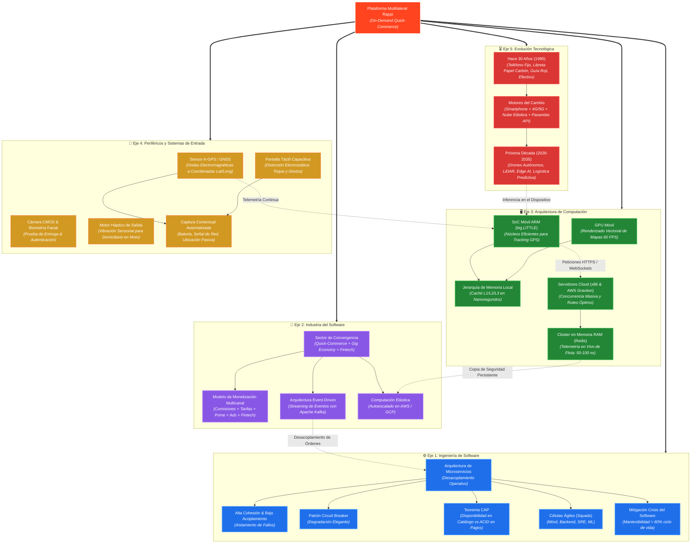

# 🗺️ Mapa Conceptual de Arquitectura: Ecosistema Rappi y Fundamentos de Computación

> Este mapa conceptual esquematiza las cinco dimensiones evaluadas en la Unidad 1 de **Introducción a la Ingeniería de Software** en la Universidad de Cartagena. Se renderiza de forma nativa en **Obsidian** y en cualquier visor de Markdown compatible con Mermaid.

---

---

## 🧭 ¿Cómo visualizar e interactuar con este mapa?

1. **En Obsidian (Modo Lectura / Vista Previa):**
   - Abre este archivo directamente en Obsidian. La plataforma compila Mermaid de forma nativa, permitiéndote hacer zoom, resaltar nodos y seguir las líneas de conexión.
2. **En Obsidian Canvas (Lienzo Infinito):**
   - En tu carpeta de entregables tienes el archivo [`Mapa_Conceptual_Rappi.canvas`](file:///home/e12jassir/Documentos/UDC/Introducci%C3%B3n%20a%20la%20Ingenier%C3%ADa%20de%20Software/Entregables/Mapa_Conceptual_Rappi.canvas). Al abrirlo en Obsidian verás un tablero interactivo con fichas arrastrables, colores y flechas visuales.
3. **En Formato Imagen Vectorial (SVG):**
   - En [`Mapa_Conceptual_Rappi.svg`](file:///home/e12jassir/Documentos/UDC/Introducci%C3%B3n%20a%20la%20Ingenier%C3%ADa%20de%20Software/Entregables/Mapa_Conceptual_Rappi.svg) tienes el gráfico vectorial renderizado en alta definición, listo para exportar a PDF o pegar en diapositivas.
