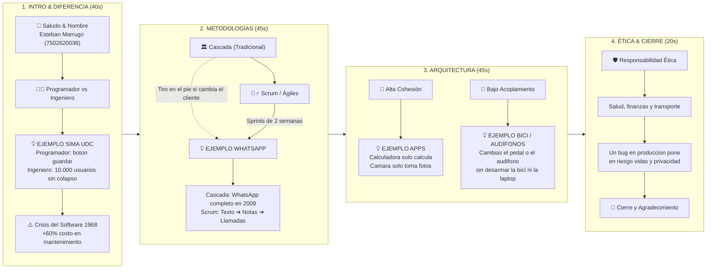

# 🎬 Mapa Visual y Hoja de Ruta — Sustentación Ing. de Software U1

---

## 📌 Guía Rápida de Palabras Clave (Para mirar de reojo)

| Bloque | Qué decir (Disparador) | Ejemplo Clave |
| :--- | :--- | :--- |
| **1. Programador vs. Ingeniero** | *El programador traduce código; el ingeniero diseña estabilidad a futuro.* | **SIMA UDC:** Que 10.000 estudiantes entren a las 11:59 p.m. sin tirar el servidor. |
| **2. Cascada vs. Scrum** | *Cascada es fijo (plano de ing. civil); Scrum es ágil por Sprints.* | **WhatsApp:** Lanzar primero texto y luego sumar notas de voz y llamadas. |
| **3. Cohesión vs. Acoplamiento** | *Cohesión = Cada módulo una sola tarea. Acoplamiento = Módulos independientes.* | **Bicicleta / Apps:** Cambiar los pedales sin desarmar la bici / Calculadora solo calcula. |
| **4. Ética & Cierre** | *Rigor técnico porque el software controla datos reales.* | *Salud, banca y privacidad ciudadana.* |

---

> [!TIP]
> **Consejo para grabar:** Pon este diagrama arriba en tu pantalla dividida justo debajo de la webcam. Al mirar los bloques, no estás leyendo, estás siguiendo el mapa mental.
