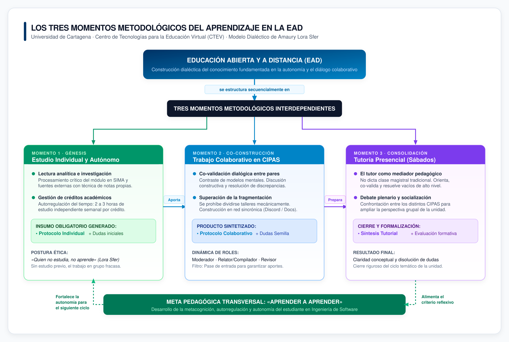

# Actividad de la Unidad 2: Los Momentos Metodológicos del Aprendizaje en la Educación Abierta y a Distancia

**Universidad de Cartagena — Centro de Tecnologías para la Educación Virtual (CTEV)**  
**Programa:** Ingeniería de Software  
**Semestre:** 1  
**Asignatura:** Metodologías y Estrategias de la Educación a Distancia (MEAD)  
**Docente:** Raquel Leottau Díaz  
**Estudiante:** Esteban David Marrugo Jassir (Código: 7502620036)  

### Evidencia de Sustentación Oficial:
• 🎥 **Video de Sustentación en Línea (Google Drive):** https://drive.google.com/file/d/1D_rvWZIOY8bM8yjzXgDl8w6NGWStoM_T/view?usp=sharing  

---

# 1. Momentos Metodológicos del Aprendizaje

## 1.1. Mapa Conceptual Jerárquico

El siguiente mapa conceptual modela la articulación dialéctica y secuencial de los Tres Momentos Metodológicos del Aprendizaje en la Educación Abierta y a Distancia (EAD), basado en las tesis pedagógicas de Amaury Lora Sfer (2014):



*Figura 1. Modelo dialéctico y jerárquico de los Tres Momentos Metodológicos del Aprendizaje en la EAD (Universidad de Cartagena).*

### Descripción de las Relaciones Proposicionales:
1. **La EAD se estructura en Tres Momentos:** No son eventos desconectados, sino un ciclo dialéctico donde cada etapa depende estrictamente de la anterior para tener validez pedagógica.
2. **Del Momento 1 al Momento 2:** El estudio individual aporta la base teórica y las notas reflexivas sin las cuales el debate en CIPAS pierde todo sentido y se convierte en una charla improvisada.
3. **Del Momento 2 al Momento 3:** La co-validación en CIPAS resuelve las dudas de nivel medio y destila las preguntas de fondo para que la tutoría presencial del sábado con el docente sea un espacio ágil de validación y no un dictado de conceptos elementales.
4. **Retroalimentación continua:** La síntesis tutorial consolida el criterio metacognitivo del estudiante, cerrando el ciclo de "aprender a aprender" y retroalimentando la autonomía para el siguiente ciclo.

---

## 1.2. Propuesta de Estrategia de Aprendizaje

### 1. Nombre de la Estrategia
**Estrategia 3C: Captura, Co-Validación y Consolidación (Ciclo de Aprendizaje Autónomo y Colaborativo en EAD).**

### 2. Objetivo
Estructurar un método sistemático y medible para gestionar el estudio autónomo, contrastar la comprensión conceptual mediante debate riguroso entre pares y co-validar los conocimientos con el docente tutor, fortaleciendo la autorregulación, la retención conceptual y el rendimiento académico en Ingeniería de Software.

### 3. Justificación
En la modalidad a distancia, el mayor peligro radica en confundir la flexibilidad horaria con desorganización, y el trabajo colaborativo con la fragmentación mecánica de entregables ("yo hago la mitad y tú la otra"). Esta estrategia introduce una rutina disciplinada inspirada en buenas prácticas de ingeniería: obliga a que cada estudiante estudie de manera previa, confronta los modelos mentales en equipo para eliminar sesgos y asegura que el tiempo presencial con el docente se aproveche al máximo en la resolución de problemas complejos.

### 4. Descripción de la Estrategia
La *Estrategia 3C* es un circuito continuo dividido en tres fases interdependientes:
- **Captura:** El estudiante procesa individualmente el módulo de estudio en SIMA y genera notas analíticas en su gestor de conocimiento personal.
- **Co-validación:** Se contrastan apuntes y comprensiones mediante sesiones sincrónicas de debate, resolviendo discrepancias y redactando acuerdos en un documento compartido.
- **Consolidación:** Se presentan las conclusiones y dudas críticas en la tutoría presencial de los sábados, integrando la retroalimentación del docente para cerrar formalmente la unidad.

### 5. Pasos o Fases para su Aplicación

```
   ┌────────────────────────────────────────────────────────────────────────┐
   │ FASE 1: CAPTURA AUTÓNOMA (Lunes a Miércoles)                          │
   │ • Lectura activa del módulo de la unidad en SIMA.                     │
   │ • Procesamiento con técnica de notas propias (Técnica Feynman).       │
   │ • Registro en Obsidian de conceptos clave y del Protocolo Individual. │
   └───────────────────────────────────┬────────────────────────────────────┘
                                       │ (Insumo individual obligatorio)
                                       ▼
   ┌────────────────────────────────────────────────────────────────────────┐
   │ FASE 2: CO-VALIDACIÓN EN CIPAS (Jueves a Viernes)                     │
   │ • Sesión sincrónica de 60-90 min por canal de voz en Discord.         │
   │ • Rueda de contrastación: comparar notas y debatir discrepancias.     │
   │ • Redacción en vivo del Protocolo Colaborativo en Google Docs oficial. │
   │ • Filtro de "Dudas Semilla" que requieren mediación del tutor.         │
   └───────────────────────────────────┬────────────────────────────────────┘
                                       │ (Agenda temática depurada)
                                       ▼
   ┌────────────────────────────────────────────────────────────────────────┐
   │ FASE 3: CONSOLIDACIÓN TUTORIAL (Sábado presencial)                    │
   │ • Participación activa en la sesión plenaria con el docente tutor.     │
   │ • Planteamiento de las dudas complejas filtradas por el grupo.        │
   │ • Registro de la síntesis tutorial y cierre evaluativo de la unidad.  │
   └────────────────────────────────────────────────────────────────────────┘
```

### 6. Papel de los Integrantes y Dinámica de Roles
Para garantizar la corresponsabilidad y la participación activa, se definen roles que rotan en cada unidad temática:
- **Moderador de Sesión:** Abre la sesión de trabajo sincrónica, controla los tiempos de intervención (máximo 5 minutos por concepto) y asegura que se discuta la totalidad de la guía.
- **Relator de Síntesis:** Registra en tiempo real los acuerdos, discrepancias y preguntas complejas en el documento institucional mientras se desarrolla el debate.
- **Revisor Técnico:** Comprueba la ortografía, la coherencia de la redacción, las citas bibliográficas en normas APA y la concordancia con la rúbrica de SIMA antes de enviar.
- **Compromiso innegociable (Pase de Entrada):** Nadie puede participar en la sesión de co-validación ni avalar el trabajo grupal sin haber completado y sustentado previamente su protocolo individual de la Fase 1.

### 7. Recursos y Herramientas Digitales
- **Obsidian / Logseq:** Entorno local en Markdown para la toma de notas estructuradas y elaboración del protocolo individual.
- **Discord (Canales de Voz y Pantalla Compartida):** Espacio sincrónico para el contraste directo de comprensiones sin la frialdad de los mensajes de texto.
- **Google Docs Institucional:** Espacio compartido de co-edición en tiempo real donde queda el registro transparente y fechado de los aportes.
- **Google Calendar / Time-blocking:** Planificación de bloques semanales de 2 a 3 horas de trabajo independiente por cada crédito académico (cumpliendo las 48 horas semestrales por crédito).

### 8. Forma de Seguimiento y Evaluación
El funcionamiento de la estrategia se supervisa mediante dos filtros concretos:
1. **Filtro de Entrada Individual:** Al iniciar la llamada de trabajo, se comparte pantalla mostrando la lectura realizada y los apuntes estructurados. Quien no haya procesado el módulo pasa a calidad de oyente.
2. **Lista de Chequeo de Co-validación:** Antes de cerrar el documento de trabajo, se verifica:
   - ¿Se abordaron todos los puntos del módulo de la unidad? (Sí/No)
   - ¿Quedó identificada al menos una duda de fondo para consultar al tutor? (Sí/No)
   - ¿El documento cumple con el rigor metodológico y las normas de presentación institucional? (Sí/No)

### 9. Resultados Esperados
- Eliminación total de entregas improvisadas o fragmentadas de última hora.
- Reducción de la ansiedad en semanas de parciales mediante el procesamiento semanal continuo.
- Dominio conceptual profundo evidenciado en calificaciones superiores a 4.5 en SIMA.
- Formación de disciplina y hábitos de comunicación técnica indispensables para el trabajo en la industria del software.

### 10. Relación con el Proceso de "Aprender a Aprender" en la EAD
"Aprender a aprender" significa dejar de ser un receptor pasivo de información y asumir el control consciente del propio proceso formativo. La *Estrategia 3C* materializa este principio en tres dimensiones clave:
- **Metacognición aplicada:** El estudiante detecta activamente qué temas no comprende durante la Fase 1 antes de que una prueba sumativa se lo demuestre con una mala calificación.
- **Construcción social:** Al argumentar y explicar un concepto ante los pares en la Fase 2, se produce el fenómeno pedagógico de que "quien enseña y fundamenta, consolida su propio saber".
- **Interacción orientada:** El alumno llega a la tutoría presencial con interrogantes precisos, transformando la educación a distancia en un diálogo formativo de alto nivel con el docente.

---

# 2. Referencias Bibliográficas (Normas APA 7.ª Edición)

- **Costa Román, Ó., & Garcia Gaitero, O.** (2017). *El aprendizaje autorregulado y las estrategias de aprendizaje*. Tendencias Pedagógicas, (30), 117–130. https://doi.org/10.15366/tp2017.30.007
- **García Aretio, L.** (2014). *Bases, mediaciones y futuro de la educación a distancia en la sociedad digital*. Editorial Síntesis.
- **Hernández-Sellés, N., Muñoz-Carril, P. C., & González-Sanmamed, M.** (2023). *Roles del docente universitario en procesos de aprendizaje colaborativo en entornos virtuales*. RIED. Revista Iberoamericana de Educación a Distancia, 26(1), 45–66. https://doi.org/10.5944/ried.26.1.34005
- **Lluch Molins, L., & Portillo Blázquez, M. C.** (2018). *La competencia de aprender a aprender en el marco de la educación superior*. Revista de Docencia Universitaria (REDU), 16(2), 223–239. https://doi.org/10.4995/redu.2018.10268
- **Lora Sfer, A.** (2014). *Metodología de la Educación Abierta y a Distancia: Los Tres Momentos del Aprendizaje y los CIPAS en la Universidad de Cartagena*. Centro de Tecnologías para la Educación Virtual (CTEV), Universidad de Cartagena.
- **Sangrá, A., Guitert, M., & Behar, P. A.** (2023). *Competencias y metodologías innovadoras para la educación digital*. RIED. Revista Iberoamericana de Educación a Distancia, 26(1), 9–23. https://doi.org/10.5944/ried.26.1.36015
