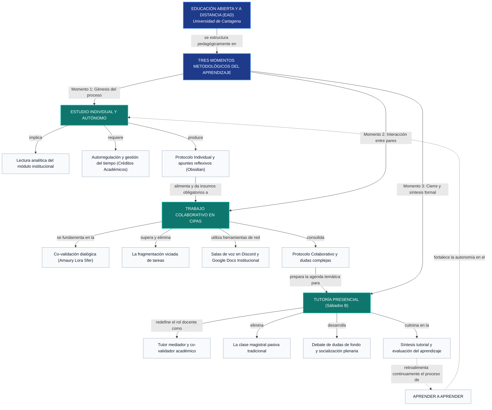

# Actividad de la Unidad 2: Los Momentos Metodológicos del Aprendizaje en la Educación Abierta y a Distancia

**Universidad de Cartagena — Centro de Tecnologías para la Educación Virtual (CTEV)**  
**Programa:** Ingeniería de Software  
**Semestre:** 1  
**Asignatura:** Metodologías y Estrategias de la Educación a Distancia (MEAD)  
**Docente:** Raquel Leottau Díaz  
**Equipo CIPAS:** Grupo 8  

### Integrantes:
• Esteban David Marrugo Jassir (Cód. 7502620036)  
• Cristian Andrés Flórez Arboleda  

### Enlaces de Sustentación Oficial:
• 🔗 **Presentación Digital (Diapositivas):** [Diapositivas Interactivas HTML / Archivo Adjunto]  
• 🎥 **Video de Sustentación (No Listado / Drive):** `[Pegar enlace del video grabado aquí]`  

---

# 1. Momentos Metodológicos del Aprendizaje

## 1.1. Mapa Conceptual Jerárquico

El siguiente mapa conceptual modela la articulación dialéctica y secuencial de los Tres Momentos Metodológicos del Aprendizaje en la Educación Abierta y a Distancia (EAD), basado en las tesis pedagógicas de Amaury Lora Sfer (2014):



### Descripción de las Relaciones Proposicionales:
1. **La EAD se estructura en Tres Momentos:** No son eventos desconectados, sino un ciclo dialéctico donde cada etapa depende estrictamente de la anterior.
2. **Del Momento 1 al Momento 2:** El estudio individual aporta la base teórica y las notas reflexivas sin las cuales el debate en CIPAS pierde todo sentido y se convierte en una charla improvisada.
3. **Del Momento 2 al Momento 3:** La co-validación en CIPAS resuelve las dudas de nivel medio y destila las preguntas de fondo para que la tutoría del sábado con el docente sea un espacio ágil de validación y no un dictado de conceptos elementales.
4. **Retroalimentación continua:** La síntesis tutorial consolida el criterio metacognitivo del estudiante, cerrando el ciclo de "aprender a aprender".

---

## 1.2. Propuesta de Estrategia de Aprendizaje

### 1. Nombre de la Estrategia
**Estrategia 3C: Captura, Co-Validación y Consolidación (Ciclo Ágil de Aprendizaje Autónomo en EAD).**

### 2. Objetivo
Estructurar un método sistemático y medible para que los integrantes del CIPAS gestionen el estudio autónomo, contrasten sus comprensiones mediante debate sincrónico entre pares y co-validen sus conocimientos con el tutor, fortaleciendo la autorregulación y la retención conceptual a largo plazo en Ingeniería de Software.

### 3. Justificación
En la modalidad a distancia, el mayor peligro radica en confundir la flexibilidad horaria con desorganización, y el trabajo en equipo con la fragmentación mecánica de entregables ("yo hago la mitad y tú la otra"). Esta estrategia se justifica porque introduce una rutina ágil inspirada en metodologías de desarrollo de software: obliga a que cada estudiante estudie de manera previa, confronta los modelos mentales en equipo para eliminar sesgos y asegura que el tiempo presencial con el docente se aproveche al máximo en la resolución de problemas complejos.

### 4. Descripción de la Estrategia
La *Estrategia 3C* es un circuito semanal continuo dividido en tres fases interdependientes:
- **Captura:** El estudiante procesa individualmente el módulo de estudio y genera notas analíticas en su gestor personal.
- **Co-validación:** El CIPAS se reúne en red mediante plataformas colaborativas para contrastar apuntes, resolver discrepancias y redactar acuerdos en un documento compartido.
- **Consolidación:** El equipo presenta sus conclusiones y dudas críticas en la tutoría presencial de los sábados, integrando la retroalimentación del docente a su sistema de estudio.

### 5. Pasos o Fases para su Aplicación

```
   ┌────────────────────────────────────────────────────────────────────────┐
   │ FASE 1: CAPTURA AUTÓNOMA (Lunes a Miércoles)                          │
   │ • Lectura activa del módulo de la unidad en SIMA.                     │
   │ • Procesamiento con Técnica Feynman (explicar con palabras propias).   │
   │ • Registro en Obsidian de conceptos y dudas para el protocolo indiv.  │
   └───────────────────────────────────┬────────────────────────────────────┘
                                       │ (Insumo individual obligatorio)
                                       ▼
   ┌────────────────────────────────────────────────────────────────────────┐
   │ FASE 2: CO-VALIDACIÓN EN CIPAS (Jueves a Viernes)                     │
   │ • Sesión sincrónica de 60-90 min por Discord.                         │
   │ • Rueda de contrastación: comparar notas y debatir diferencias.       │
   │ • Redacción en vivo del Protocolo Colaborativo en Google Docs oficial. │
   │ • Filtro de "Dudas Semilla" que requieren mediación del tutor.         │
   └───────────────────────────────────┬────────────────────────────────────┘
                                       │ (Agenda temática depurada)
                                       ▼
   ┌────────────────────────────────────────────────────────────────────────┐
   │ FASE 3: CONSOLIDACIÓN TUTORIAL (Sábado presencial)                    │
   │ • Participación activa en la sesión plenaria con el docente tutor.     │
   │ • Planteamiento de las dudas complejas filtradas por el CIPAS.        │
   │ • Registro de la síntesis tutorial y cierre de la unidad.             │
   └────────────────────────────────────────────────────────────────────────┘
```

### 6. Papel de los Integrantes del CIPAS
Para garantizar que todos participen y nadie se recueste sobre el trabajo ajeno, los roles rotan en cada unidad:
- **Moderador de Sesión:** Abre la llamada en Discord, controla los tiempos de intervención (máximo 5 minutos por concepto) y asegura que se discuta la totalidad de la guía.
- **Relator de Síntesis (Compilador):** Registra en tiempo real los acuerdos y desacuerdos en el Google Docs institucional mientras el equipo debate de viva voz.
- **Revisor Técnico:** Comprueba la ortografía, la coherencia de la redacción, las citas bibliográficas en normas APA y la concordancia con la rúbrica de SIMA antes de enviar.
- **Compromiso innegociable:** Nadie puede entrar a la Fase 2 sin haber completado y mostrado su protocolo individual de la Fase 1.

### 7. Recursos y Herramientas Digitales
- **Obsidian / Logseq:** Entorno local en Markdown para la toma de notas atómicas y estructuración del protocolo individual.
- **Discord (Canales de Voz y Pantalla Compartida):** Espacio sincrónico para la reunión del CIPAS, donde se discuten los temas sin la frialdad de los mensajes de texto.
- **Google Docs (Cuentas `@unicartagena.edu.co`):** Espacio compartido de co-edición en tiempo real donde queda el registro transparente de las aportaciones de cada miembro.
- **Google Calendar / Time-blocking:** Bloques de 2 horas programados en la semana para cumplir con la equivalencia de horas por crédito académico (2 a 3 horas autónomas por crédito).

### 8. Forma de Seguimiento y Evaluación
El CIPAS evalúa el funcionamiento de la estrategia mediante dos instrumentos concretos:
1. **Pase de Entrada al CIPAS (Filtro individual):** Al iniciar la llamada de Discord, cada integrante comparte pantalla 30 segundos mostrando su lectura realizada y sus notas. Quien no haya leído, pasa a calidad de oyente y no firma el protocolo de la semana.
2. **Lista de Chequeo de Co-validación:** Antes de cerrar el documento colaborativo, el equipo verifica:
   - ¿Discutimos todos los puntos de la guía? (Sí/No)
   - ¿Quedó registrada al menos una discrepancia o duda real del grupo? (Sí/No)
   - ¿Tenemos listas 1 o 2 preguntas de alto nivel para hacerle al profesor el sábado? (Sí/No)

### 9. Resultados Esperados
- Eliminación total de la entrega de tareas copiadas o fragmentadas a última hora.
- Reducción del estrés en semanas de parciales, al tener notas procesadas semanalmente.
- Dominio conceptual profundo evidenciado en calificaciones superiores a 4.5 en SIMA.
- Formación de disciplina y hábitos de comunicación asertiva indispensables para el trabajo en equipo en la industria del software.

### 10. Relación con el Proceso de "Aprender a Aprender" en la EAD
"Aprender a aprender" significa dejar de ser un receptor pasivo de información y convertirse en el arquitecto del propio conocimiento. La *Estrategia 3C* materializa este principio porque:
- Desarrolla la **metacognición**: el estudiante detecta activamente qué no entiende durante la Fase 1 antes de que un examen se lo demuestre con una mala nota.
- Fomenta la **co-construcción social**: al explicarle un concepto al compañero de CIPAS en la Fase 2, se produce el fenómeno pedagógico más potente: "quien enseña, aprende dos veces".
- Transforma la **interacción docente**: el alumno llega a la tutoría con preguntas precisas, transformando la educación a distancia en un diálogo formativo de alto nivel.

---

# 2. Sustentación de la Estrategia (Guion de Diapositivas)

Estructura diseñada para presentación en Canva, Google Slides o PowerPoint:

### Diapositiva 1: Portada
- **Título:** Estrategia 3C: Captura, Co-Validación y Consolidación
- **Subtítulo:** Modelo Ágil de Aprendizaje Autónomo en la Educación a Distancia
- **Asignatura:** Metodología de la Educación a Distancia
- **CIPAS:** Grupo 8 — Esteban David Marrugo Jassir & Cristian Andrés Flórez Arboleda
- **Institución:** Universidad de Cartagena — Facultad de Ingeniería

### Diapositiva 2: El Problema en la EAD y la Justificación
- **El desafío:** El riesgo del aislamiento, la procrastinación y la mala práctica de dividirse los talleres como retazos.
- **Nuestra propuesta:** Pasar del trabajo fragmentado al ciclo dialéctico propuesto por Amaury Lora Sfer.
- **La solución 3C:** Un método de tres fases continuas que sincroniza el trabajo individual, el debate grupal y la tutoría presencial.

### Diapositiva 3: Los Tres Momentos y el Mapa Conceptual
- **Visual:** Diagrama simplificado del Mapa Conceptual.
- **Momento 1 (Individual):** Estudio autónomo y lectura profunda (insumo de entrada).
- **Momento 2 (CIPAS):** Co-validación dialógica en red (construcción social).
- **Momento 3 (Tutoría):** Validación experta y resolución de dudas complejas con el docente.

### Diapositiva 4: Fases Operativas y Herramientas Digitales
- **Fase 1 - Captura (Lun-Mié):** Módulos SIMA + Notas en Obsidian.
- **Fase 2 - Co-validación (Jue-Vie):** Reunión sincrónica en Discord + Redacción compartida en Google Docs.
- **Fase 3 - Consolidación (Sábados):** Participación activa y resolución de dudas con el tutor en el CTEV.
- **Roles rotativos:** Moderador, Relator y Revisor Técnico.

### Diapositiva 5: Seguimiento, Evaluación y Resultados
- **Filtros de control:** "Pase de entrada" al CIPAS (revisión de lectura previa) y lista de chequeo de co-validación.
- **Resultados medibles:** Cero tareas improvisadas, comprensión profunda antes de los exámenes y calificaciones excelentes.

### Diapositiva 6: Conclusión: ¿Cómo fortalece el "Aprender a Aprender"?
- **Autonomía:** Responsabilidad sobre el propio horario según el sistema de créditos.
- **Metacognición:** Capacidad de identificar vacíos conceptuales a tiempo.
- **Frase de cierre:** *"En la educación a distancia, quien no estudia no aprende; pero quien aprende a co-validar en equipo, lidera su formación universitaria."*

---

# 3. Guion Oficial del Video de Sustentación

**Modalidad:** Sustentación Individual en calidad de Vocero del CIPAS (por inasistencia a la tutoría presencial).  
**Recurso en pantalla:** Diapositivas interactivas en HTML / pantalla completa con cámara encendida.  
**Duración objetivo:** 3:30 a 4:00 minutos.  

---

### [0:00 - 0:45] Diapositiva 1 — Portada y Presentación
"Un cordial saludo para la docente Raquel Leottau Díaz y compañeros del curso. Mi nombre es **Esteban David Marrugo Jassir**, estudiante de primer semestre de Ingeniería de Software en la Universidad de Cartagena y vocero del **CIPAS Grupo 8**. 

Debido a mi inasistencia a la sesión presencial programada, procedo a realizar la sustentación oficial de nuestra actividad de la Unidad 2: la **Estrategia 3C: Captura, Co-validación y Consolidación**, un modelo metodológico diseñado para aplicar con rigor los tres momentos del aprendizaje en la educación abierta y a distancia."

---

### [0:45 - 1:30] Diapositiva 2 — El Problema y la Justificación
*(Pasar a Diapositiva 2)*  
"Esta propuesta nace de un diagnóstico real que vivimos en la modalidad a distancia. Muchas veces se comete el grave error de confundir la flexibilidad de horarios con la procrastinación, o de caer en la mala práctica de dividirse los talleres como retazos de tela: 'yo hago dos puntos y tú haces los otros dos'. 

Como bien sostiene el pedagogo Amaury Lora Sfer, la educación a distancia no es un mosaico de partes pegadas, sino un proceso dialéctico. Si el estudiante no realiza un estudio individual previo, el trabajo en CIPAS fracasa; y si el CIPAS no co-valida saberes, la tutoría presencial del sábado pierde todo su valor formativo."

---

### [1:30 - 2:20] Diapositiva 3 — Los Tres Momentos y el Mapa Conceptual
*(Pasar a Diapositiva 3)*  
"Para modelar esta articulación, diseñamos nuestro mapa conceptual jerárquico basado en los Tres Momentos Metodológicos:

1. **Primer Momento: Estudio Individual y Autónomo.** Es la génesis del proceso. El estudiante analiza el módulo en SIMA, gestiona sus horas según el sistema de créditos (dedicando entre 2 y 3 horas autónomas por crédito) y redacta su Protocolo Individual. Es un insumo obligatorio e intransferible.
2. **Segundo Momento: Co-validación en CIPAS.** Aquí los integrantes nos reunimos no a repartir tareas, sino a confrontar qué entendió cada uno, resolver discrepancias y redactar el Protocolo Colaborativo, identificando las dudas complejas no resueltas.
3. **Tercer Momento: Tutoría Presencial.** Los sábados en el salón, el profesor no llega a dictar una clase magistral desde cero; actúa como un mediador pedagógico que co-valida las dudas de fondo que el grupo llevó preparadas, consolidando el ciclo de aprender a aprender."

---

### [2:20 - 3:15] Diapositivas 4 y 5 — Fases de la Estrategia 3C y Mecanismos de Control
*(Pasar a Diapositiva 4)*  
"Aterrizando esta teoría a la práctica de la Ingeniería de Software, creamos la **Estrategia 3C**:
- **Fase 1 - Captura (Lunes a Miércoles):** Cada miembro procesa el módulo en su gestor personal como Obsidian, aplicando la técnica Feynman para explicar los conceptos con palabras propias.
- **Fase 2 - Co-validación (Jueves a Viernes):** Nos reunimos por canal de voz en Discord y abrimos un Google Docs institucional. Con roles rotativos (moderador y relator), contrastamos apuntes, resolvemos diferencias y filtramos las 'Dudas Semilla'.
- **Fase 3 - Consolidación (Sábados):** Se participa activamente en la tutoría con la docente Raquel para resolver las dudas complejas.

*(Pasar a Diapositiva 5)*  
Para que esta estrategia no se quede en el papel, establecimos un filtro estricto: el **Pase de Entrada al CIPAS**. Quien no comparta pantalla al iniciar la llamada mostrando su lectura y notas de la Fase 1, pasa a calidad de oyente y no firma el protocolo de la semana. Con esto eliminamos las entregas improvisadas de última hora y garantizamos un dominio conceptual real para las evaluaciones."

---

### [3:15 - 3:45] Diapositiva 6 — Conclusión y Cierre
*(Pasar a Diapositiva 6)*  
"Como conclusión final, esta estrategia impacta directamente en nuestra capacidad de aprender a aprender: nos enseña a ser autocríticos con el manejo del tiempo, a detectar vacíos conceptuales a tiempo y a entender que el trabajo en equipo en la industria del software exige disciplina y comunicación asertiva.

En la educación a distancia, quien no estudia no aprende; pero quien aprende a co-validar en equipo, lidera con autonomía su formación universitaria. Muchísimas gracias por su atención."

---

# 4. Referencias Bibliográficas (Normas APA 7.ª Edición)

- **Costa Román, Ó., & Garcia Gaitero, O.** (2017). *El aprendizaje autorregulado y las estrategias de aprendizaje*. Tendencias Pedagógicas, (30), 117–130. https://doi.org/10.15366/tp2017.30.007
- **García Aretio, L.** (2014). *Bases, mediaciones y futuro de la educación a distancia en la sociedad digital*. Editorial Síntesis.
- **Hernández-Sellés, N., Muñoz-Carril, P. C., & González-Sanmamed, M.** (2023). *Roles del docente universitario en procesos de aprendizaje colaborativo en entornos virtuales*. RIED. Revista Iberoamericana de Educación a Distancia, 26(1), 45–66. https://doi.org/10.5944/ried.26.1.34005
- **Lluch Molins, L., & Portillo Blázquez, M. C.** (2018). *La competencia de aprender a aprender en el marco de la educación superior*. Revista de Docencia Universitaria (REDU), 16(2), 223–239. https://doi.org/10.4995/redu.2018.10268
- **Lora Sfer, A.** (2014). *Metodología de la Educación Abierta y a Distancia: Los Tres Momentos del Aprendizaje y los CIPAS en la Universidad de Cartagena*. Centro de Tecnologías para la Educación Virtual (CTEV), Universidad de Cartagena.
- **Sangrá, A., Guitert, M., & Behar, P. A.** (2023). *Competencias y metodologías innovadoras para la educación digital*. RIED. Revista Iberoamericana de Educación a Distancia, 26(1), 9–23. https://doi.org/10.5944/ried.26.1.36015


