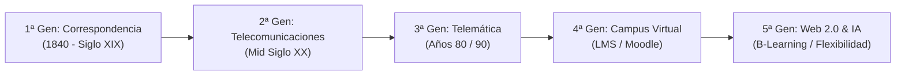
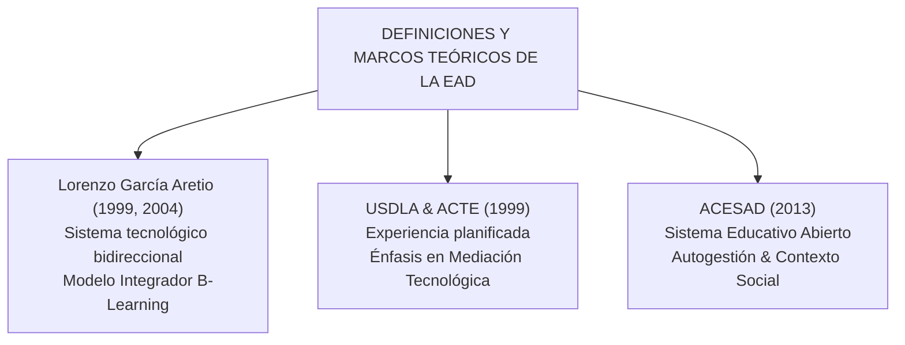
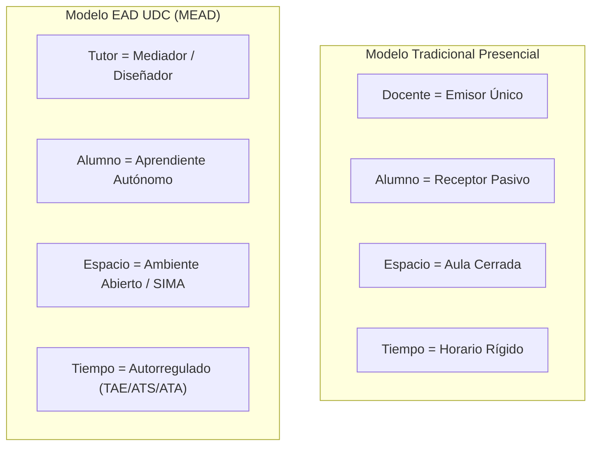
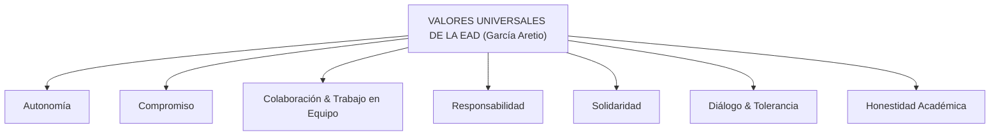
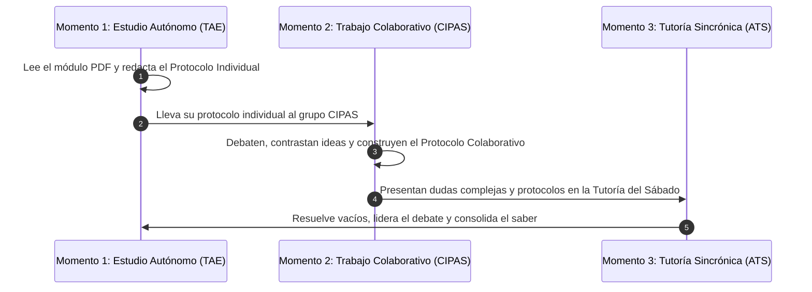

# Apuntes Exhaustivos Unidad 1 — Metodología de la Educación a Distancia (MEAD)

**Asignatura:** Metodologías y Estrategias de la Educación a Distancia  
**Código:** `FN24015-A1` | **Facultad:** Ingeniería de Software a Distancia  
**Unidad 1:** Historia, Conceptos, Características de la EAD y Campus SIMA  
**Docente:** Raquel Leottau | **Entidad Administradora:** CTEV UDC  
**Créditos Académicos:** 2 (Total: `96 horas` | `72h` TAE · `16h` ATS · `8h` ATA)  

---

> [!IMPORTANT]
> **Tesis Central de la Unidad:**  
> La Educación a Distancia (EAD) no es una versión "rebajada" ni una mera transmisión digital de la universidad tradicional; es un **paradigma pedagógico autónomo, abierto y flexible**, fundamentado en el **constructivismo social** y la **autorregulación**. En la Universidad de Cartagena, la tecnología no reemplaza la pedagogía: actúa como **mediación pedagógica** a través del Campus Virtual **SIMA** para transformar al alumno en un aprendiente independiente y al docente en un tutor orientador.

---

## 🏛️ 1. Evolución Histórica de la EAD: Las 5 Generaciones y las 3 Eras

La EAD no nació con la computadora. Es la respuesta histórica y sistemática de la sociedad para **superar las barreras del tiempo y el espacio** en el acceso al conocimiento.

### A. Las 3 Grandes Eras Históricas

#### 1. Era de la Correspondencia (Siglo XVIII – Siglo XIX)
- **Antecedente Documentado (1728):** **Caleb Phillips** en Boston ofrece lecciones semanales de taquigrafía enviadas por correo postal. Marca el inicio documentado de la instrucción asincrónica sin presencia física del docente.
- **Institucionalización (1840 – 1843):** **Sir Isaac Pitman** formaliza la enseñanza enviando lecciones y correcciones de taquigrafía por correo. En 1843 se funda la *Phonographic Correspondence Society*, estableciendo la primera estructura organizada de tutoría y evaluación a distancia.
- **Mecanismos:** Imprenta, material impreso (módulos, guías) y servicio postal público.
- **Naturaleza Comunicativa:** Unidireccional y asincrónica de respuesta muy lenta. El material debía ser autosuficiente porque el tutor tardaba semanas en responder.

#### 2. Era de las Telecomunicaciones / Multimedia (Mediados del Siglo XX / 1969)
- **Tecnologías:** Radio educativa, televisión abierta/cerrada, audiocasetes, videocasetes y teléfono.
- **Avance:** Permitió la **difusión masiva del conocimiento** rompiendo fronteras geográficas a gran escala.
- **Fundación de la Open University (1969):** Se crea en el Reino Unido, consolidando la EaD con estatus universitario e introduciendo el modelo de diseño instruccional sistemático, combinando materiales impresos, emisiones de TV y tutorías regionales.
- **Limitación Pedagógica:** Siguió siendo predominantemente **unidireccional** en sus inicios. El estudiante era un receptor de programas audiovisuales sin interacción fluida sincrónica.

#### 3. Era Telemática y Digital (Fines del Siglo XX - Presente)
- **Tecnologías:** Fusión de computadoras personalizadas, redes de alta velocidad, bases de datos y la Web.
- **Avance:** Pasó de la simple recepción pasiva a la **bidireccionalidad y multidireccionalidad interactiva** (sincrónica mediante videollamadas/chats y asincrónica mediante foros y LMS).

---

### B. Las 5 Generaciones de EAD (Clasificación de Nipper y Taylor)

| Generación | Denominación | Medios Técnicos Dominantes | Modelo Pedagógico e Interacción |
| :---: | :--- | :--- | :--- |
| **1ª Gen** | **Modelo por Correspondencia** | Textos impresos, guías de estudio, correo postal. | Estudio individual estricto. Cero interacción entre pares. Comunicación tutor-alumno muy lenta. |
| **2ª Gen** | **Modelo Multimedia** | Impresos + Radio, TV, Casetes, Diapositivas, Teléfono. | Integración de múltiples medios para enriquecer la explicación. Comunicación unidireccional masiva. |
| **3ª Gen** | **Modelo Teleinformático** | Correo electrónico, salas de chat iniciales, disquetes/CD-ROM. | Primeros indicios de redes de aprendizaje. Inicio de la comunicación interactiva asincrónica. |
| **4ª Gen** | **Modelo de Campus Virtual (LMS)** | Plataformas web integradas (Moodle, WebCT), bases de datos en línea. | Centralización del aula virtual. Interacción fluida sincrónica y asincrónica en un único entorno. |
| **5ª Gen** | **Modelo Inteligente / Flexible** | B-Learning, M-Learning, analítica de datos, contenidos adaptativos, IA. | **Aprendizaje autorregulado y colaborativo avanzado.** Flexibilidad total ajustada al contexto del estudiante. |

---

## 🎓 2. Marcos Teóricos, Autores y Definiciones Rigurosas

### A. Lorenzo García Aretio (1999, 2004) — *Referente Principal*
> *"Un sistema tecnológico de comunicación bidireccional, que sustituye la interacción personal en el aula de profesor-alumno por la acción sistemática y conjunta de diversos recursos didácticos y el apoyo de una organización tutorial, que propician el aprendizaje autónomo del alumno"*.

* **Desglose conceptual de la definición de García Aretio:**
  1. **Sistema tecnológico:** No es una improvisación; es una estructura organizada donde cada componente (plataforma, contenidos, evaluación) interactúa con los demás.
  2. **Comunicación bidireccional:** El flujo de información no es un monólogo; el estudiante consulta, responde, debate y recibe retroalimentación.
  3. **Acción sistemática y conjunta de recursos:** El material didáctico está diseñado intencionalmente para enseñar por sí mismo (*mediación pedagógica*).
  4. **Organización tutorial:** Existe una institución que respalda, orienta y evalúa (en la UDC, el **CTEV** y los tutores).

* **Modelo Integrador y Ecléctico (García Aretio, 2004):**  
  Propone un modelo basado en el **constructivismo social**. Defiende que el mejor esquema de EAD es el **B-Learning (Blended Learning)**, pues logra conectar armónicamente:
  - El **aprendizaje autónomo** (estudio individual previo).
  - El **aprendizaje colaborativo** (construcción colectiva con pares en CIPAS).
  - La **mediación tecnológica** ajustada al contexto del alumno.

### B. USDLA y ACTE (1999)
- **USDLA** (*United States Distance Learning Association*) & **ACTE** (*Association for Educational Communications and Technology*):
  - Definen la EAD como: *"Una experiencia planificada de enseñanza-aprendizaje que utiliza una amplia gama de tecnologías para lograr la atención del estudiante a distancia y estimular la interacción sin mediar un contacto físico"*.
  - **Aporte clave:** Resaltan la importancia de la **planificación previa de las mediaciones** como el aspecto más significativo de la modalidad.

### C. ACESAD (2013) — *Enfoque Institucional Colombiano*
- **ACESAD** (*Asociación Colombiana de Educación Superior a Distancia*):
  - Define la EAD como: *"Un sistema educativo abierto que propende por la formación integral de individuos con énfasis en la autogestión del aprendizaje a través de diversos medios y acciones pedagógicas que articulan la experiencia vital del estudiante con las necesidades socioculturales y el saber académico"*.
  - **Aporte clave:** Incorpora la **dimensión social e integral**. La EAD no solo transmite teoría, sino que vincula la realidad laboral y familiar del alumno con su desarrollo profesional.

---

## ⚡ 3. Atributos de la EAD y Transformación Epistemológica de Roles

### A. Atributos Esenciales de la Modalidad EAD

1. **Carácter de Educación Abierta:**
   - **Eliminación de barreras y privilegios:** No discrimina por edad, ocupación laboral, ubicación geográfica ni experiencia previa.
   - **Democratización de la educación:** Permite que sectores tradicionalmente excluidos de la universidad presencial accedan a títulos profesionales de alta calidad.
2. **Flexibilidad Cognitiva y Temporal:**
   - El estudiante no está atado a semestres rígidos de asistencia diaria ni a ritmos homogéneos. Respeta los factores internos (ritmo de aprendizaje, motivación) y externos (trabajo, hogar).
3. **Énfasis en la Autonomía y Autoaprendizaje:**
   - Asume que los adultos son capaces de **auto-aprender** cualquier contenido si se les provee la mediación didáctica adecuada y el lenguaje mediador correcto.

---

### B. Matriz Comparativa Profunda: Universidad Presencial vs. EAD UDC

| Dimensión Epistemológica | Educación Presencial Tradicional | Educación a Distancia (UDC / MEAD) |
| :--- | :--- | :--- |
| **Paradigma Dominante** | Centrado en la **Ensegnanza** (lo que el profesor dice y hace). | Centrado en el **Aprendizaje** (lo que el estudiante investiga y construye). |
| **Rol del Docente** | **Profesor Magistral:** Transmisor lineal de contenidos, "dictador de clases", evaluador sumativo final. | **Tutor / Mediador Pedagógico:** Orientador, diseñador de ambientes de aprendizaje, facilitador de debates y evaluador formativo. |
| **Rol del Estudiante** | **Alumno Pasivo:** Dependiente de la explicación presencial en el aula (heteronomía). | **Aprendiente Autónomo:** Protagonista activo, investigador, responsable de su ruta de estudio (autorregulación). |
| **Naturaleza del Espacio** | Aula física cerrada, rígida y geográficamente localizada. | Espacios dispersos, ambientes virtuales interactivos (**Campus SIMA**). |
| **Gestión del Tiempo** | Horarios inflexibles con pensum rígido diario. | Tiempo de estudio autorregulado por el aprendiente en bloques **TAE, ATS y ATA**. |
| **Evaluación** | Enfocada en memorización en exámenes presenciales únicos. | Proceso continuo mediante **Protocolo Individual**, **Protocolo Colaborativo (CIPAS)**, **TCC** y **SIMA**. |

---

## 📖 4. Glosario Técnico Exhaustivo (Definición de Términos "Raros")

| Término | Definición Técnica Profunda | Aplicación en la UDC |
| :--- | :--- | :--- |
| **Telemática** | Disciplina científica y tecnológica que surge de la unión de las *Telecomunicaciones* y la *Informática*. Permite el procesamiento, almacenamiento y transmisión digital de datos educativos en redes interconectadas. | Es la base técnica que hace posible que el Campus SIMA funcione 24/7 en la Web. |
| **B-learning (*Blended Learning*)** | Modalidad mixta de aprendizaje que combina la enseñanza presencial/sincrónica con el trabajo autónomo virtual en plataformas digitales. | **Es el modelo de la UDC:** combina el estudio autónomo en SIMA con las tutorías de los sábados. |
| **E-learning (*Electronic Learning*)** | Formación 100% virtual a través de plataformas en línea, sin ningún tipo de encuentro presencial. | Se aplica en cursos 100% asincrónicos o diplomados virtuales del CTEV. |
| **M-learning (*Mobile Learning*)** | Submodalidad del e-learning optimizada para el acceso a contenidos pedagógicos desde dispositivos móviles (celulares/tablets). | Permite responder foros o revisar PDF de SIMA desde la App móvil de Moodle. |
| **Mediación Pedagógica** | Conjunto de acciones, recursos, lenguajes y guías didácticas que el tutor utiliza para hacer accesible el conocimiento, permitiendo que el estudiante aprenda de forma autónoma sin la presencia física del profesor. | Los módulos en PDF, las guías de actividades y los foros son mediaciones pedagógicas. |
| **Constructivismo Social** | Enfoque pedagógico (Vygotsky / García Aretio) que postula que el conocimiento no es una copia pasiva de la realidad, sino una construcción colectiva mediante el diálogo, la interacción y el debate con el entorno y los pares. | Es la base teórica del trabajo colaborativo en los equipos **CIPAS**. |
| **Aprendizaje Autorregulado** | Proceso metacognitivo activo donde el estudiante establece sus propias metas de estudio, monitorea su comprensión, administra su tiempo y autoevalúa su desempeño sin requerir supervisión externa constante. | Es la competencia que exige dedicar `72 horas` de trabajo autónomo (TAE) en la asignatura. |
| **Metacognición** | La capacidad de "pensar sobre el propio pensamiento". Implica ser consciente de cómo aprendemos, cuáles son nuestros puntos débiles y qué estrategias debemos ajustar. | Es lo que aplicás al hacer los resúmenes y preguntas de *Active Recall* en tu protocolo. |
| **LMS (*Learning Management System*)** | Sistema de Gestión de Aprendizaje. Es una plataforma de software instalada en un servidor web que administra, distribuye y controla las actividades educativas. | Moodle es el LMS que utiliza la Universidad de Cartagena. |
| **SIMA** | **Sistema de Mediación del Aprendizaje**: Nombre institucional de la plataforma educativa virtual de la UDC construida sobre Moodle. | Es donde entregás los protocolos, realizás cuestionarios y participás en foros. |
| **CTEV** | **Centro Tecnológico de Formación Virtual y a Distancia**: Unidad académica y técnica de la UDC encargada del diseño pedagógico, soporte de SIMA y capacitación en la modalidad. | Es el organismo que elabora los proyectos docentes y apoya a la docente Raquel Leottau. |
| **TAE** | **Trabajo Autónomo del Estudiante**: Horas de estudio individual de lectura y elaboración de protocolos sin presencia del docente (`72h` en MEAD). | Tiempo no negociable que debes reservar en tu calendario semanal. |
| **ATS** | **Acompañamiento Tutorial Sincrónico**: Horas de interacción directa en tiempo real entre el tutor y los estudiantes (`16h` en MEAD). | Ocurre en las tutorías presenciales/virtuales de los días sábados B. |
| **ATA** | **Acompañamiento Tutorial Asincrónico**: Horas de orientación que el tutor dedica a responder foros, corregir entregas y resolver dudas en SIMA (`8h` en MEAD). | Consultas en el foro "Pregúntale al Profesor" o mensajería interna. |

---

## 💎 5. Valores Universales de la Educación a Distancia

Según **García Aretio (1999)** y la fundamentación del módulo, la EAD no es solo un método de instrucción técnica; es una **escuela de vida** que demanda y fortalece los siguientes valores éticos y humanos:

> [!NOTE]
> **Descripción de Valores Clave:**
> 1. **Autonomía:** Libertad responsable para adueñarse del propio proceso de formación y tomar decisiones cognitivas.
> 2. **Compromiso y Disciplina:** Persistencia para cumplir con los bloques de estudio TAE sin necesidad de un control externo.
> 3. **Colaboración y Trabajo en Equipo:** Disposición para construir conocimiento en el CIPAS sin actitudes individualistas.
> 4. **Responsabilidad:** Asumir las consecuencias del propio aprendizaje y entregar las evidencias a tiempo en SIMA.
> 5. **Solidaridad y Diálogo:** Respeto por las ideas del compañero en foros y apertura para debatir mediante el lenguaje mediador.
> 6. **Honestidad Académica:** Rigor en la autoría de los escritos, evitando el plagio y citando correctamente a los autores.

---

## 💻 6. El Ecosistema Virtual UDC: Campus SIMA y Los 3 Momentos

### A. Estructura y Navegación del Aula Virtual en SIMA

El aula virtual en SIMA (diseñada por el CTEV) se organiza bajo una arquitectura estándar dividida en 3 zonas operativas:

> [!TIP]
> **Estructura del Aula en SIMA:**
> - **1. Pestaña de Presentación:** Proyecto Docente (PDF), Guía de Actividades, Foro "Pregúntale al Profesor", Enlace a Tutorías y Turnitin.
> - **2. Pestañas de Unidad (1 a 8):** Módulos PDF, Lecturas eLibro, Buzón de Protocolo Individual, Buzón de Protocolo Colaborativo y Cuestionario.
> - **3. Pestaña de Actividades Finales:** Trabajo Colaborativo Contextualizado (TCC - 20%) y Examen Final (40%).

---

### B. Los 3 Momentos del Aprendizaje UDC (Metodología Oficial)

El aprendizaje en la modalidad a distancia de la UDC no ocurre de forma caótica; sigue un **proceso secuencial en tres momentos estrictos**:

1. **Momento 1 — Estudio Autónomo (TAE):**  
   El estudiante realiza la lectura previa del módulo de la unidad de manera individual y redacta su **Protocolo Individual** (Resumen, Glosario, Preguntas y Dudas).
2. **Momento 2 — Trabajo Colaborativo (CIPAS):**  
   Los integrantes del CIPAS se reúnen (virtual o presencialmente), discuten sus protocolos individuales, resuelven discrepancias y redactan un único **Protocolo Colaborativo**.
3. **Momento 3 — Tutoría Sincrónica (ATS):**  
   Encuentro con la docente (Raquel Leottau) en el aula/videollamada. **No se va a escuchar una clase magistral desde cero**, sino a debatir, resolver las dudas del punto 4 del protocolo y consolidar el conocimiento.

---

## 💡 7. Banco de Preguntas de Autoevaluación y Examen Final

A continuación tenés las preguntas clave del módulo con sus explicaciones técnicas profundas para repasar antes de los cuestionarios en SIMA:

<b>1. ¿Por qué la EAD según ACESAD (2013) se considera un "sistema educativo abierto"?</b>

<b>Respuesta completa:</b> Porque elimina las barreras de entrada tradicionales (edad, horarios fijos, necesidad de presencia física constante) y adecua sus procedimientos a las condiciones ocupacionales, laborales y familiares de los estudiantes, democratizando el acceso al saber superior.

<b>2. ¿En qué consiste el cambio de rol del profesor a "tutor mediador" según García Aretio?</b>

<b>Respuesta completa:</b> El profesor deja de ser el emisor único y central de conocimientos que dicta clases unidireccionales. Pasa a ser un diseñador de ambientes de aprendizaje, orientador de investigaciones, facilitador de debates colaborativos y acompañante pedagógico del proceso de autorregulación del aprendiente.

<b>3. ¿Cuál es la diferencia sustancial entre E-learning y B-learning, y por qué la UDC utiliza B-learning?</b>

<b>Respuesta completa:</b> El E-learning es una formación 100% virtual sin encuentros presenciales, mientras que el B-learning (Blended Learning) es un modelo mixto que combina el trabajo autónomo en plataformas digitales con tutorías presenciales o sincrónicas. La UDC utiliza B-learning porque su modelo metodológico combina el estudio autónomo en SIMA con los encuentros de tutoría de los sábados.

<b>4. ¿Qué significan y cómo se distribuyen las 96 horas totales de la asignatura MEAD?</b>

<b>Respuesta completa:</b> Se distribuyen en 3 componentes del Proyecto Docente: <b>72 horas TAE</b> (Trabajo Autónomo del Estudiante para lectura y redacción de protocolos), <b>16 horas ATS</b> (Acompañamiento Tutorial Sincrónico en vivo con la docente) y <b>8 horas ATA</b> (Acompañamiento Tutorial Asincrónico en foros y plataforma SIMA).

---

## 🔗 Registro de Documentos y Fuentes Oficiales UDC
- 📖 **Módulo Didáctico Oficial:** [Modulo Unidad 1 curso.pdf](file:///home/e12jassir/Documentos/UDC/Metodolog%C3%ADa%20de%20la%20Educaci%C3%B3n%20a%20Distancia/Unidad%201/Modulo%20Unidad%201%20curso.pdf)
- 📜 **Proyecto Docente MEAD:** [ProyectodocenteMEADSOFTWARE.pdf](file:///home/e12jassir/Documentos/UDC/Metodolog%C3%ADa%20de%20la%20Educaci%C3%B3n%20a%20Distancia/Recursos/ProyectodocenteMEADSOFTWARE.pdf)
- 📝 **Protocolo Individual de la Unidad:** [Protocolo Individual 1.md](file:///home/e12jassir/Documentos/UDC/Metodolog%C3%ADa%20de%20la%20Educaci%C3%B3n%20a%20Distancia/Unidad%201/Protocolo%20Individual%201.md)
- 🗓️ **Cronograma de Actividades:** [Cronograma de Actividades.md](file:///home/e12jassir/Documentos/UDC/Metodolog%C3%ADa%20de%20la%20Educaci%C3%B3n%20a%20Distancia/Cronograma%20de%20Actividades.md)
